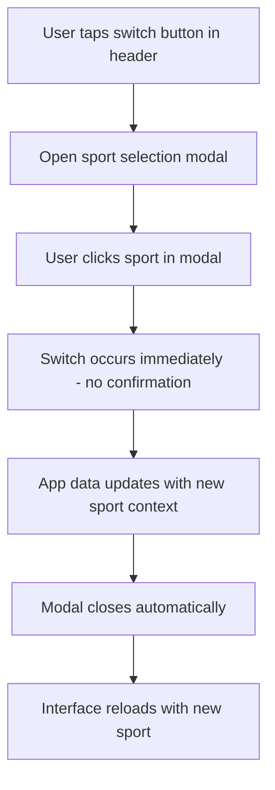
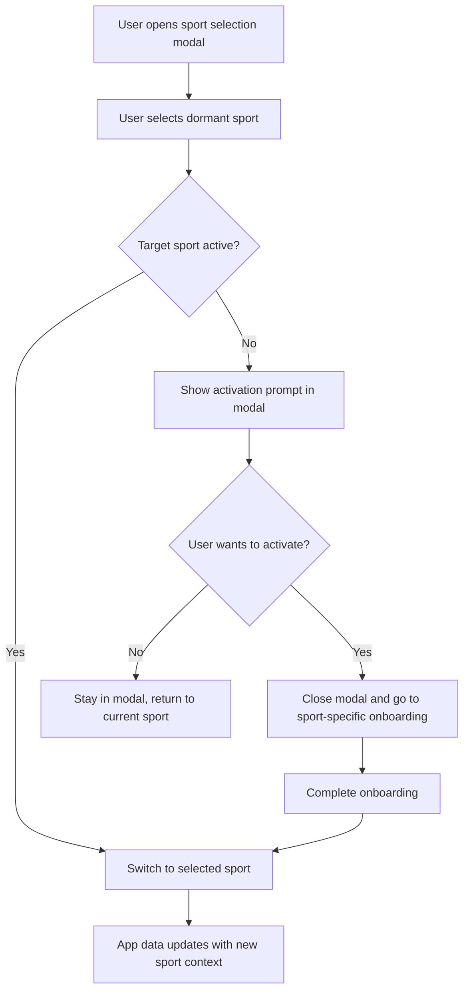
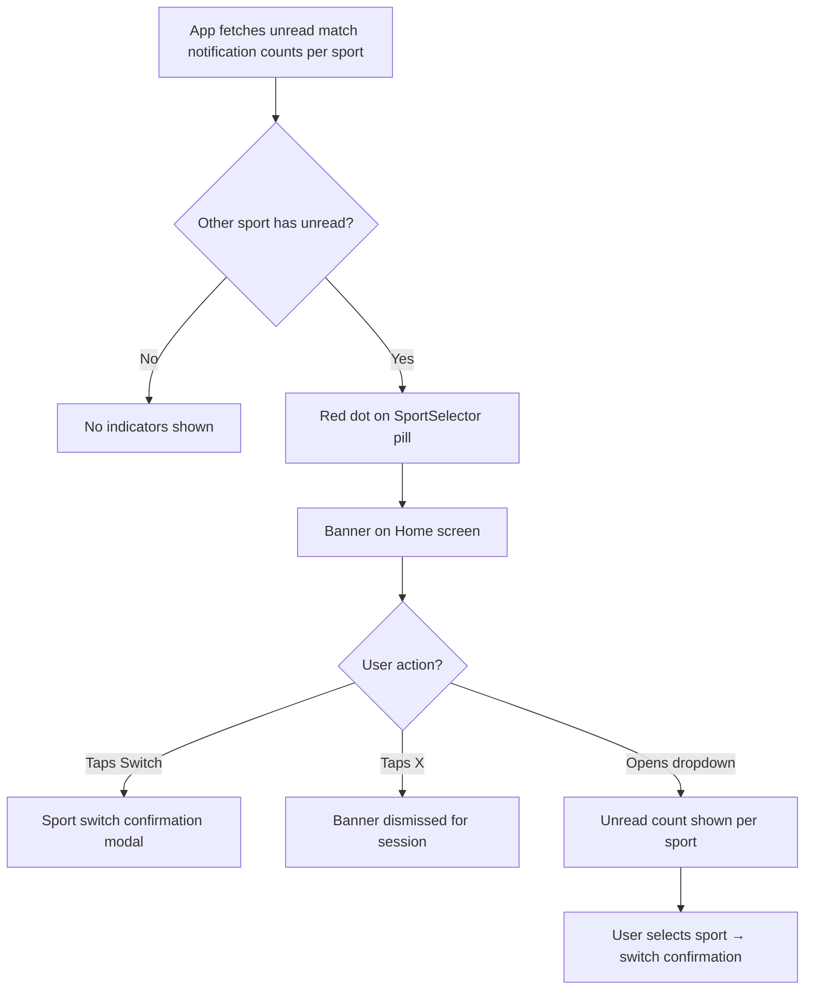

# Interface Switching

## Overview

Users with both sports active can switch between Tennis and Pickleball universes.

## Switch Mechanism

### Switch Button

- Button located in the app header
- Shows current sport mode clearly
- Tapping the button opens a modal for sport selection

### Sport Selection Modal

- Modal displays available sports (Tennis, Pickleball)
- Current sport is highlighted/indicated
- Clicking a sport in the modal switches directly - no confirmation required
- App data updates immediately when selection changes
- Modal closes automatically after selection

### Selection Flow

## Behavior

### What Changes on Switch

| Element            | Behavior                                    |
| ------------------ | ------------------------------------------- |
| Player Directory   | Shows players of the new sport              |
| Matches            | Shows matches of the new sport              |
| Groups/Communities | Shows groups of the new sport               |
| Ratings            | Shows rating for the new sport              |
| Reputation         | Shared across sports (same player behavior) |
| Navigation         | Updates to reflect sport context            |
| Theme/Colors       | Updates to sport-specific palette           |

### What Persists

| Element       | Behavior                              |
| ------------- | ------------------------------------- |
| User account  | Same account, different sport profile |
| Settings      | Most settings are shared              |
| Blocked users | Blocks apply across sports            |

## Dormant Sport Activation

If a user selects a dormant sport from the modal:

## Cross-Sport Pending Actions Alert

Players with multiple sports can miss actions (match invitations, join requests, etc.) in their non-active sport. The app proactively surfaces these to prevent missed games.

### How It Works

Every match-related notification carries a `sportName` field in its `payload` JSONB (e.g. `"tennis"`, `"pickleball"`). The app queries unread match-notification counts per sport to detect pending actions in non-active sports.

### Visual Indicators

| Element                          | Behavior                                                                                             |
| -------------------------------- | ---------------------------------------------------------------------------------------------------- |
| **Sport Selector pill** (header) | Red dot badge (8px) appears when any non-active sport has unread match notifications                 |
| **Sport Selector dropdown**      | Each non-selected sport shows an unread count pill (e.g. "3") next to its name                       |
| **Home screen banner**           | Dismissible banner above "My Matches" per sport with unread count, sport icon, and a "Switch" button |

### Banner Behavior

- One banner per sport that has unread match notifications
- Tapping "Switch" triggers the sport switch confirmation flow
- Dismissing (X button) hides the banner for that sport until the next app session (state resets on app reopen)
- Banner only appears for fully onboarded, signed-in users

### Flow

## UX Guidelines

- Make current sport always visible (header, tab bar, etc.)
- Use animation for smooth transition
- Preserve navigation state when possible
