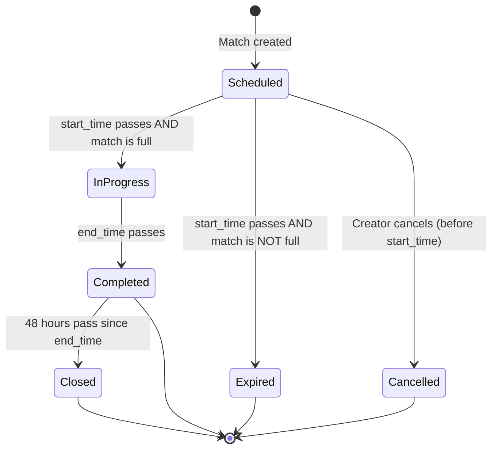
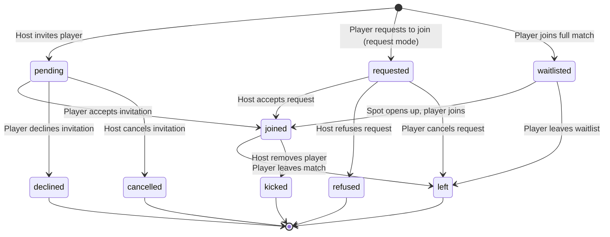

# Match Lifecycle

## Overview

Complete flow from match creation to completion, including participant management, join modes, and match state transitions.

## Match States

Match status is **derived** at runtime from match attributes — there is no stored status column. The derivation uses two layers:

1. **`deriveMatchStatus()`** — a pure function in `shared-utils` that computes the **core status** from time and cancellation fields
2. **UI-level overlays** — the match detail UI combines the core status with **match fullness** and **time-since-end** to display finer-grained states like "expired" and "closed"

### Core Status Derivation (`deriveMatchStatus`)

Inputs:

- `cancelled_at`: If set, match is cancelled
- `match_date` / `start_time` / `end_time` / `timezone`: For time calculations
- `result`: If present (truthy), match is completed

**Priority order:**

1. `cancelled` — `cancelled_at IS NOT NULL`
2. `completed` — `result IS NOT NULL` OR `end_time` has passed
3. `in_progress` — `start_time` has passed but `end_time` hasn't
4. `scheduled` — default (match hasn't started)

```typescript
type DerivedMatchStatus = 'scheduled' | 'in_progress' | 'completed' | 'cancelled';
```

**Note:** The core derivation does **not** check match fullness. Fullness is evaluated separately in the UI to determine display states.

### UI Display States

The UI combines the core status with additional checks:



| Display State | Core Status                  | Additional Condition                     | Description                              |
| ------------- | ---------------------------- | ---------------------------------------- | ---------------------------------------- |
| `scheduled`   | `scheduled`                  | —                                        | Match hasn't started yet                 |
| `in_progress` | `in_progress`                | Match is full                            | Match is currently happening             |
| `expired`     | `in_progress` or `completed` | Match is NOT full                        | Start time passed but not enough players |
| `completed`   | `completed`                  | Match is full AND within 48h of end_time | Match ended, feedback window open        |
| `closed`      | `completed`                  | Match is full AND 48h+ since end_time    | Match archived, feedback window expired  |
| `cancelled`   | `cancelled`                  | —                                        | Match was cancelled by creator           |

**Key behaviors:**

- **Expired** is derived as `(in_progress || completed) && !isFull` — if a match wasn't full when start_time passed, it shows as expired regardless of time progression
- **Closed** is derived by checking whether the 48h feedback window has elapsed after end_time. The automated `close-matches` edge function also sets `closed_at` on the match record at this point
- Only **full** matches progress through `in_progress` → `completed` → `closed`

### Match Fullness Calculation

A match is considered **full** when:

- Total capacity = format-based (singles: 2 players, doubles: 4 players)
- Current participants = count of participants with `joined` status (including creator)
- Match is full when: `current >= total`

**Note:** Only participants with `joined` status count toward match capacity. Participants with `pending`, `requested`, `waitlisted`, or other statuses do not fill spots.

## Participant Statuses

Each participant has a status that tracks their relationship to the match:

| Status       | Description                                      | Who Can Set                                    | Transitions From                     |
| ------------ | ------------------------------------------------ | ---------------------------------------------- | ------------------------------------ |
| `pending`    | Invited by host, awaiting response               | Host (via invite)                              | -                                    |
| `requested`  | Player requested to join, awaiting host approval | Player (in request mode)                       | -                                    |
| `joined`     | Actively participating                           | Player (direct join) or Host (accepts request) | `pending`, `requested`, `waitlisted` |
| `waitlisted` | On waitlist for full match                       | System (when match is full)                    | -                                    |
| `declined`   | Player declined an invitation                    | Player                                         | `pending`                            |
| `refused`    | Host refused a join request                      | Host                                           | `requested`                          |
| `left`       | Voluntarily left the match                       | Player                                         | `joined`, `requested`, `waitlisted`  |
| `kicked`     | Removed by host                                  | Host                                           | `joined`                             |
| `cancelled`  | Invitation cancelled by host                     | Host                                           | `pending`                            |

### Participant Status Flow



## Join Modes

Matches support two join modes that determine how players can participate:

### Direct Join Mode (`join_mode: 'direct'`)

- Players can join immediately without approval
- When player joins → status becomes `joined`
- First-come-first-served basis
- If match is full → status becomes `waitlisted`

### Request Mode (`join_mode: 'request'`)

- Players must request to join
- When player requests → status becomes `requested`
- Host receives notification
- Host can accept (→ `joined`) or refuse (→ `refused`)
- If match is full → status becomes `waitlisted` (can still request)

## Match Creation & Invitations

### Creating a Match

1. Creator sets match details (date, time, location, format, etc.)
2. Creator chooses join mode (direct or request)
3. Creator can invite specific players or make match public
4. Invited players receive `pending` status

### Inviting Players

- Host can invite players before match starts (while match is `scheduled`)
- **Restriction:** Cannot invite when match is full (all spots taken) — invitations are only available when there are open spots
- Invited players receive `pending` status
- Host can cancel invitations (→ `cancelled` status)
- Host can resend invitations (for `pending` or `declined` players)

## Joining a Match

### Direct Join Mode

1. Player taps "Join Now"
2. If match has spots:
   - Status → `joined`
   - Both creator and player notified
3. If match is full:
   - Status → `waitlisted`
   - Player notified they're on waitlist

### Request Mode

1. Player taps "Request to Join"
2. Status → `requested`
3. Host receives notification
4. Host can:
   - Accept → Status → `joined` (see [Accepting a Join Request](#accepting-a-join-request))
   - Refuse → Status → `refused` (see [Refusing a Join Request](#refusing-a-join-request))

### Accepting a Join Request

Only the match host can accept. The following validations are enforced:

1. Match is not cancelled (`cancelled_at` is null)
2. Match is not completed (`end_time` has not passed)
3. Caller is the match host (`created_by`)
4. Participant exists and has `requested` status
5. Match has available capacity (joined count < total spots)

**Note:** The backend checks `end_time`, not `start_time` — meaning a host can accept a request for an in-progress match as long as it hasn't ended. The UI disables the accept button once the match is in progress, but the backend does not enforce this.

On success:

- Participant status → `joined`, `joined_at` timestamp recorded
- Player notified (`match_join_accepted` notification, fire-and-forget)
- If the match is now full, a group chat is created for all joined participants + host

### Refusing a Join Request

Only the match host can refuse. Same validation checks as accepting (cancelled, completed, host authorization, participant exists, `requested` status) — except there is no capacity check (refusing doesn't require an open spot).

On success:

- Participant status → `refused`
- Player notified (`match_join_rejected` notification, fire-and-forget)

### Accepting Invitations

1. Player with `pending` status taps "Accept Invitation"
2. If direct join mode and spots available:
   - Status → `joined`
3. If request mode:
   - Status → `requested` (still needs host approval)
4. If match is full:
   - Status → `waitlisted`

## Leaving & Cancellation

### Player Leaves Match

- Player with `joined` status can leave before the match starts (`scheduled` state)
- Leave button is hidden once match is `in_progress` (**enforced in UI only** — the backend `leaveMatch` service does not check match status)
- Status → `left`
- All remaining `joined` participants notified (including creator)
- Spot becomes available (waitlisted players can join)

### Player Cancels Request

- Player with `requested` status can cancel their request
- Status → `left`
- Host notified

### Host Kicks Participant

- Host can remove `joined` participants
- **Restriction:** Cannot kick within 24 hours of start_time (enforced in UI only — the backend checks that the match hasn't ended but does not enforce the 24h window)
- Status → `kicked`
- Player notified
- Spot becomes available

**Rationale:** Prevents last-minute removals that leave players stranded.

### Match Cancellation

- Only creator can cancel entire match
- **Cannot cancel after start_time** — once a match's start time has passed, cancellation is blocked
- Sets `cancelled_at` timestamp
- Match state → `cancelled`
- All participants notified
- No further actions allowed (join, leave, edit)

**Note:** Creators cancel matches; they do not "leave" them. If a creator no longer wants to participate, they must cancel the entire match.

### Late Cancellation Penalties

Reputation penalties apply using **graduated brackets** based on proximity to match start time. Creators receive harsher penalties than participants (~1.5×). All penalties are capped below `match_no_show` (-50) to preserve the distinction that cancelling is still better than ghosting.

#### Preconditions for Penalties

All of the following must be true for a penalty to apply:

1. **Court is reserved** (`court_status === 'reserved'`)
2. **Other participants have joined** (not just the host)
3. **Cooling-off period expired** — if match was created less than 1 hour ago, no penalty
4. **Planned match** — match was created more than 24 hours before start time
5. **Within 24 hours of start** — cancellations 24h+ before start incur no penalty

#### Graduated Penalty Brackets

| Time Before Start | Creator Penalty | Participant Penalty |
| ----------------- | --------------- | ------------------- |
| 24+ hours         | 0               | 0                   |
| 12–24 hours       | -10             | -7                  |
| 6–12 hours        | -20             | -13                 |
| 2–6 hours         | -35             | -22                 |
| 0–2 hours         | -45             | -28                 |

**Note:** The code also defines an "after start" bracket (creator: -45, participant: -33), but this is unreachable for normal cancellations since cancellation is blocked after start_time. It exists as a safety net for system-level cancellations.

#### History Multiplier

Penalties are adjusted based on the player's recent cancellation history (last 30 days):

| Recent Offenses (30 days) | Multiplier |
| ------------------------- | ---------- |
| 0 (first offense)         | 0.5×       |
| 1                         | 1.0×       |
| 2                         | 1.5×       |
| 3+                        | 2.0×       |

After applying the multiplier, the final penalty is floored at -49 (one less than no-show) to ensure cancelling is always better than not showing up.

#### For Participants Leaving Within 24h of Start Time

| Condition                                                    | Penalty Applied?                                      |
| ------------------------------------------------------------ | ----------------------------------------------------- |
| Match is **full** AND created **more than 24h** before start | **YES** (graduated) - Committed spot on planned match |
| Match is **not full**                                        | **NO** - No one is stranded                           |
| Match created **less than 24h** before start                 | **NO** - Last-minute match, flexible commitment       |

**Rationale:** This protects against last-minute bailouts on planned matches while allowing flexibility for spontaneous, last-minute matches. Players who make others commit and then bail are penalized, but impromptu matches remain low-commitment. The graduated system ensures that cancelling 23 hours before is much less punishing than cancelling 1 hour before.

**Implementation Notes:**

- The `created_at` timestamp on the match record is used to determine if the match was planned (>24h before start) or spontaneous (<24h before start)
- If a match's date/time is edited, the `last_modified_at` timestamp is also considered
- Penalty events are created immediately when the participant leaves or creator cancels
- Penalty calculation lives in `shared-services/src/reputation/reputationPenalties.ts`

#### `host_edited_at` — Penalty Exception for Host Edits

Every time a match creator updates a match, the `host_edited_at` field is set to the current timestamp. When a participant leaves within 24h of start time, the system checks `host_edited_at`: if the host recently edited the match (e.g., changed date/time/location), the leaving participant is **exempt from the late cancellation penalty**. This ensures players are not penalized for leaving a match whose conditions changed after they committed.

## Match Progression

### Before Match Starts (`scheduled`)

- Players can join/leave
- Host can edit match details
- Host can invite/kick participants
- Host can accept/reject requests

### During Match (`in_progress`)

- Match is happening (between start_time and end_time)
- Match is full (was full at start_time, composition cannot change)
- No join/leave actions allowed (**enforced in UI only** — the backend `leaveMatch` and `joinMatch` services do not check match status; the UI hides the buttons)
- No editing allowed
- Limited UI actions (view only)
- **Check-in available** (see Check-In section)

### Match Expired (`expired`)

- Start time has passed but match is NOT full
- Match did not get enough players before start time
- **Terminal state** - match remains expired forever (does not transition to closed)
- No join/leave actions allowed (too late to join)
- No editing allowed
- Match is considered unsuccessful
- Cannot transition to `in_progress`, `completed`, or `closed` states

### After Match Ends (`completed`)

- Match has ended (end_time passed AND match is full)
- Match completed successfully
- No join/leave actions allowed
- Results can be recorded
- Feedback can be collected

### Match Closed (`closed`)

- 48 hours have passed since end_time AND match is full
- Match is archived (`closed_at` timestamp is set)
- No actions allowed
- Historical record only
- Only matches that were full at start_time can reach this state

**What happens at closure:**

An automated job runs hourly to close eligible matches. When a match is closed:

1. **Mutual cancellation check**: If majority of participants selected `match_outcome = 'mutual_cancel'`, match is flagged as `mutually_cancelled` with no reputation impact
2. **Feedback aggregation**: For non-cancelled matches, each participant's feedback is aggregated using majority rule (benefit of doubt on ties)
3. **Reputation events created**: Based on aggregated feedback (`match_completed`, `match_no_show`, `match_on_time`, `match_late`, star ratings)
4. **Participant records updated**: `showed_up`, `was_late`, `star_rating`, `aggregated_at` fields are set

See [Match Closure](./match-closure.md) for complete details on the feedback and closure system.

## Match Reminders

All `joined` participants receive reminders before their match:

| Timing            | Channel      | Content                                           |
| ----------------- | ------------ | ------------------------------------------------- |
| 24 hours before   | Push + Email | Full match details (location, time, participants) |
| 2 hours before    | Push         | "Your match is coming up!"                        |
| 10 minutes before | Push         | Check-in request with location verification       |

See [Notifications](../08-communications/notifications.md) for full notification specifications.

## Check-In

### Overview

Players can check-in to confirm their physical presence at the match location.

### Availability

Check-in requires **all** of the following conditions:

- **Time window:** Within 10 minutes before start_time to end_time
- **Match is full:** All spots must be filled (check-in is not available for non-full matches)
- **Location is set:** Match must have a confirmed location (`facility` or `custom` — not `tbd`)
- **Location permission granted:** Device location permission must be active for geolocation verification
- **Player is a `joined` participant** who hasn't already checked in

The 10-minute pre-match window coincides with the check-in reminder notification. Check-in is optional — not required to complete the match.

### How It Works

1. Player receives check-in reminder (10 minutes before start)
2. Player opens match detail during the check-in window
3. System verifies player's location against match coordinates
4. If within acceptable radius (100m), `checked_in_at` timestamp is recorded on the participant record
5. Check-in status visible to all participants

### Data Model

| Field           | Type      | Description                                         |
| --------------- | --------- | --------------------------------------------------- |
| `checked_in_at` | timestamp | When the player checked in (null if not checked in) |

Check-in state is derived:

- `checked_in_at` is NULL → not checked in
- `checked_in_at` is set → checked in at that time

## Sharing Matches

### In-App Sharing (Creator Only)

Match creators can share matches to groups and communities within Rallia:

- Available any time before match starts
- Share to groups the creator belongs to
- Share to communities the creator belongs to

### Social Media Sharing

Anyone can share match details to external platforms, any time before the match starts.

**How It Works:**

- Generates shareable link/card
- Shows: Date, time, location, format, spots available
- Link opens match in app (or app store if not installed)

**Platforms:** Native share sheet (iOS/Android)

## Waitlist Behavior

### When Match is Full

- New join attempts → `waitlisted` status
- Players remain on waitlist until spot opens
- **No ordering:** Waitlist has no priority order (not FIFO, not by reputation)

### When Spot Opens

- All waitlisted players receive a notification that a spot is available
- Players must actively join when notified (no auto-join)
- First player to respond gets the spot
- If direct join mode: Status → `joined` immediately
- If request mode: Status → `requested` (still needs host approval)

### Leaving Waitlist

- Waitlisted players can leave the waitlist at any time (before match starts)
- Status → `left`
- No notification to creator (reduces noise)

## Multi-Recipient Invitations

When match is sent to multiple players:

- Each invited player gets `pending` status
- First to accept gets the spot (if direct join)
- Others remain `pending` until:
  - They accept (if spots available)
  - They decline (status → `declined`)
  - Host cancels their invitation (status → `cancelled`)

## Notifications Summary

| Event                        | Creator Notified       | Participant Notified                          |
| ---------------------------- | ---------------------- | --------------------------------------------- |
| Player joins (direct)        | ✅ Yes                 | ✅ Confirmation                               |
| Player requests to join      | ✅ Yes                 | ✅ Confirmation                               |
| Request accepted             | ❌ No (host initiated) | ✅ Yes (`match_join_accepted`)                |
| Request refused              | ❌ No (host initiated) | ✅ Yes (`match_join_rejected`)                |
| Invitation declined (single) | ✅ Yes                 | N/A                                           |
| Invitation declined (multi)  | ❌ No (check status)   | N/A                                           |
| Player leaves                | ✅ Yes                 | ✅ Confirmation                               |
| Player kicked                | ✅ Confirmation        | ✅ Yes                                        |
| Match cancelled              | N/A                    | ✅ Yes (all participants)                     |
| Spot opens (waitlist)        | N/A                    | ✅ Yes (waitlisted players)                   |
| **Match updated**            | N/A                    | ✅ Yes (joined, if notifiable fields changed) |

### Match Updated Notification Details

When the creator updates a match, a `match_updated` notification is sent to all `joined` participants **excluding the creator**. The notification is only triggered when at least one "notifiable" field changes.

**Notifiable fields** (trigger notification):

| Category | Fields                                                                               |
| -------- | ------------------------------------------------------------------------------------ |
| Time     | `matchDate`, `startTime`, `endTime`, `duration`, `customDurationMinutes`, `timezone` |
| Location | `locationType`, `facilityId`, `courtId`, `locationName`, `locationAddress`           |
| Cost     | `isCourtFree`, `estimatedCost`, `costSplitType`                                      |
| Format   | `format`, `playerExpectation`                                                        |

**Non-notifiable fields** (no notification sent):

- `visibility`, `visibleInGroups`, `visibleInCommunities`
- `joinMode`
- `preferredOpponentGender`, `minRatingScoreId`
- `notes`
- `courtStatus`

**Notification payload** includes: `matchId`, list of updated fields, `sportName`, `matchDate`, `startTime`. Each notification is localized to the recipient's `preferred_locale`.

**Delivery:** Fire-and-forget after the DB update succeeds (does not block the update response). Delivered via push and/or email based on user notification preferences.

## Schedule Conflicts

### Detection

When player tries to join:

- System checks calendar for conflicts
- If conflict found, shows warning

### Behavior

| Scenario             | Action                       |
| -------------------- | ---------------------------- |
| Conflict detected    | Warn player, allow override  |
| Player joins anyway  | Their responsibility         |
| Creator not informed | Conflict is receiver's issue |

## Non-User Acceptance

When someone not on the app accepts:

1. They provide: Name, Email, Phone
2. They receive calendar confirmation
3. They're prompted to install app
4. Their info goes to growth mailing list
5. They can participate in match chat via web (or app if installed)

> **Growth Hack:** Converts non-users to users.

## Match Chat

Match chat is available for coordinating match details (meeting point, equipment, etc.).

### Availability

- **Only `joined` participants** can access match chat
- Chat is **created** when the match becomes **full** (all spots filled) — a group chat is initialized for all `joined` participants including the host
- Players with `pending`, `requested`, or `waitlisted` status cannot access chat
- If a player leaves a full match and then someone else joins (re-filling the match), the new player is added to the existing chat
- Chat remains accessible until match is `closed`

### Content

- Text messages only
- All `joined` participants see all messages
- No moderation (but can be reported via match feedback)

See [Communications](../08-communications/chat.md) for full chat specifications.
