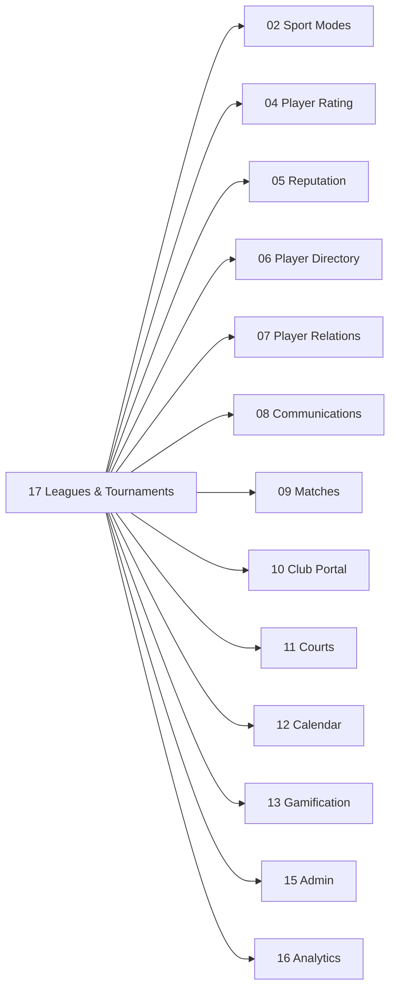

# Leagues & Tournaments

> Recurring competitive structures (leagues) and single-event eliminations (tournaments) for Rallia tennis and pickleball.

This system extends the casual match loop (system 09) into structured competition. Tournaments produce a winner from a fixed bracket; leagues produce ongoing seasonal rankings from recurring sessions.

## Scope

| Capability                          | Tournaments | Leagues |
| ----------------------------------- | ----------- | ------- |
| Single-elimination bracket          | ✅          | —       |
| Double-elimination bracket          | v2          | —       |
| Seasonal ranking                    | —           | ✅      |
| Recurring sessions with match sheet | —           | ✅      |
| Per-event registration              | ✅          | —       |
| Permanent membership                | —           | ✅      |
| Point-based standings               | —           | ✅      |
| Bracket-position progression        | ✅          | —       |
| Per-sport (Tennis or Pickleball)    | ✅          | ✅      |

A single tournament or league belongs to **exactly one sport** (Tennis or Pickleball), per the Sport Modes principle in [02-sport-modes](../02-sport-modes/README.md).

### Deliberate divergences from the original French scope

The source brief in `_archive/SPEC_LEAGUES_TOURNAMENTS_V2.md` (and the upstream `SCOPE LIGUES & TOURNOIS.docx`) suggests two patterns we explicitly do **not** follow:

- **One entity → both sports.** The brief allows a league to support "Tennis, Pickleball, ou les deux." Rallia's [02-sport-modes/data-separation.md](../02-sport-modes/data-separation.md) requires complete sport-universe separation, so leagues and tournaments are scoped to exactly one sport. A user who wants both runs two parallel entities.
- **One tournament → singles + doubles bracket.** The brief allows a tournament to host "Simple, Double, ou les deux." We model these as two separate tournaments to keep brackets, registrations, and scoring schemas single-purpose. The mobile UI surfaces a "Companion tournament" link so organizers can pair them visually.

Both choices simplify the data model and avoid a class of cross-cutting bugs at the cost of slightly more organizer setup. Documented here so future contributors don't reverse the decision without thinking through the implications.

## Document Structure

| File                                             | Purpose                                                                                           |
| ------------------------------------------------ | ------------------------------------------------------------------------------------------------- |
| [tournaments.md](./tournaments.md)               | Tournament lifecycle, registration, cancellation, reschedule, archival                            |
| [tournament-bracket.md](./tournament-bracket.md) | Bracket sizing, deterministic seed placement, BYEs, manual edits, double-elimination              |
| [leagues.md](./leagues.md)                       | League / season / session lifecycle, membership, suspension, mid-season impact                    |
| [match-sheet.md](./match-sheet.md)               | Pairing algorithms (BY_RANK, AVOID_REPEAT, SWISS, BALANCED_DOUBLES), round/court allocator        |
| [score-entry.md](./score-entry.md)               | Score format regexes, sport-aware validator, retirement/walkover, dispute resolution              |
| [ranking.md](./ranking.md)                       | Points, bonuses/malus, tie-breakers, ranking calculation, stored vs derived                       |
| [notifications.md](./notifications.md)           | Per-event notification payloads, channels, i18n keys, deep-links, batching                        |
| [permissions.md](./permissions.md)               | Role × action matrix, RLS policy snippets                                                         |
| [data-model.md](./data-model.md)                 | Postgres DDL, enums, FKs, indexes, RLS, triggers, derived columns                                 |
| [integrations.md](./integrations.md)             | Cross-system contracts (sport modes, rating, reputation, communities, calendar, chat, facilities) |
| [mobile-ux.md](./mobile-ux.md)                   | Mobile screen inventory, navigation, wizards, bracket viz, score-entry, organizer dashboard       |
| [web-organizer-ux.md](./web-organizer-ux.md)     | Web admin views for organizers and clubs                                                          |
| [analytics.md](./analytics.md)                   | PostHog event taxonomy, funnels, properties                                                       |
| [edge-cases.md](./edge-cases.md)                 | Consolidated anomaly handling                                                                     |
| [monetization.md](./monetization.md)             | Integration boundary with [18-monetization](../18-monetization/) for entry fees and refunds       |
| [rollout.md](./rollout.md)                       | Feature flag, beta cohort, backfill, performance budgets, observability                           |

## Dependencies

| System              | Use                                                                                                       |
| ------------------- | --------------------------------------------------------------------------------------------------------- |
| 02 Sport Modes      | Each league/tournament is scoped to exactly one sport; UI lives inside the active sport universe          |
| 04 Player Rating    | Certified `rating_score` is the primary seeding source; T&L matches feed M5 evolution like casual matches |
| 05 Reputation       | T&L emits the same reputation events (`match_no_show`, `match_cancelled_late`, `match_completed`, etc.)   |
| 06 Player Directory | Public tournaments and leagues are discoverable in directory and on the interactive map                   |
| 07 Player Relations | Communities and groups can own a league/tournament; visibility inherits                                   |
| 08 Communications   | Notifications, in-app/email/SMS channels, auto-created chat per session and per tournament                |
| 09 Matches          | Tournament matches and league session matches reuse the casual-match data shape and feedback loop         |
| 10 Club Portal      | Clubs can host leagues/tournaments, allocate courts, view organizer dashboards                            |
| 11 Courts           | Sessions/matches use `facility_id` and court inventory; optional booking integration                      |
| 12 Calendar         | Sessions and tournament matches surface in user calendar; iCal export                                     |
| 13 Gamification     | New badges (`tournament_winner`, `season_top_3`, `perfect_attendance`)                                    |
| 15 Admin            | GOD MODE can edit any tournament/league; audit log viewer                                                 |
| 16 Analytics        | PostHog event taxonomy (see [analytics.md](./analytics.md))                                               |

## Roles

Roles are scoped per league or per tournament — a user can be Organizer in one and Member in another.

| Role                 | Tournament                                                              | League                                                                    |
| -------------------- | ----------------------------------------------------------------------- | ------------------------------------------------------------------------- |
| **Organizer**        | Full control: create, edit, manage participants, update scores, close   | Full control: create, configure, manage seasons/sessions, validate scores |
| **Co-Organizer**     | Same as Organizer except cannot delete the entity or transfer ownership | Same as Organizer except cannot delete the entity or transfer ownership   |
| **Member**           | (n/a — see Participant)                                                 | Participate in sessions, confirm presence, enter scores, view ranking     |
| **Participant**      | Register, report scores, view bracket                                   | (n/a — see Member)                                                        |
| **Former Member**    | (n/a)                                                                   | Historical access, no participation                                       |
| **Spectator**        | View bracket and results (if PUBLIC)                                    | View ranking (if PUBLIC)                                                  |
| **Guest** (unauthed) | Browse PUBLIC bracket and results; no register/score                    | Browse PUBLIC ranking; no join/score                                      |

Full action-by-action matrix in [permissions.md](./permissions.md).

## Phasing

| Phase    | Scope                                                                                                                                                                                                                                                                                                                                    |
| -------- | ---------------------------------------------------------------------------------------------------------------------------------------------------------------------------------------------------------------------------------------------------------------------------------------------------------------------------------------- |
| **MVP**  | Tournament 4–32 single-elim, manual seeding, registration (OPEN/INVITE/APPROVAL), score entry, bracket auto-advance, manual bracket edits, in-app notifications, audit log. League creation, OPEN/CLOSED season, sessions with confirmations, BY_RANK match sheet, score entry with organizer validation, ranking with tie-breakers 1–4. |
| **v1.1** | Tournament waitlist, doubles tournament, session capacity & multi-round, doubles match sheet (BALANCED_DOUBLES), bonuses system, CSV ranking export.                                                                                                                                                                                     |
| **v2**   | Double-elimination bracket, AVOID_REPEAT pairing, SWISS pairing, Elo-style adjustment, season rule overrides UI, **pool play (poules) for large sessions**, **API integrations** (calendar, club booking systems), advanced fairness metrics, public-API integrations.                                                                   |

## Glossary

| Term             | Definition                                                                            |
| ---------------- | ------------------------------------------------------------------------------------- |
| **Tournament**   | Single-event competition with fixed bracket, one winner, defined participants         |
| **League**       | Recurring competitive structure with seasons and sessions, ongoing ranking            |
| **Season**       | Time-bounded period within a league (e.g., "Winter 2026") with its own ranking        |
| **Session**      | Single play date within a league season                                               |
| **Match Sheet**  | Generated pairings for a session (who plays whom, on which court)                     |
| **Bracket**      | Tournament elimination tree (single or double)                                        |
| **Seed**         | Pre-ranked player placed in protected bracket position                                |
| **BYE**          | Automatic advancement when no opponent available (counts as participation in leagues) |
| **Walkover**     | Win awarded when opponent fails to appear (`W/O`)                                     |
| **Retirement**   | Match result where one player stops mid-match (`RET`)                                 |
| **Super TB**     | 10-point tie-break used in lieu of a final set                                        |
| **H2H**          | Head-to-head record between two players                                               |
| **Confirmation** | A member's response (CONFIRMED / DECLINED / PENDING) to a published session           |

## Error code index

Authoritative list — all server-side validation failures must use one of these codes. Each code maps to an i18n key in `packages/shared-translations/src/locales/{en-US,fr-CA}.json` under `errors.leaguesTournaments.<code>`.

| Code                           | HTTP | Where                 | Meaning                                                                                                                                                 |
| ------------------------------ | ---- | --------------------- | ------------------------------------------------------------------------------------------------------------------------------------------------------- |
| `TOURNAMENT_FULL`              | 409  | Registration          | Bracket size reached; new entries go to waitlist                                                                                                        |
| `TOURNAMENT_REG_CLOSED`        | 409  | Registration          | Registration window has ended                                                                                                                           |
| `TOURNAMENT_REG_PENDING`       | 200  | Registration          | Approval pending (informational, not an error)                                                                                                          |
| `TOURNAMENT_NOT_DRAFT`         | 409  | Edit                  | Edit attempted on tournament past DRAFT                                                                                                                 |
| `NOT_INVITED`                  | 403  | Registration          | `invite_only` mode and caller has no invite row                                                                                                         |
| `INSUFFICIENT_PARTICIPANTS`    | 409  | Bracket gen           | Fewer than 2 active registrations at generation time                                                                                                    |
| `BRACKET_NOT_GENERATED`        | 409  | Match action          | Cannot operate on matches before bracket exists                                                                                                         |
| `BRACKET_ALREADY_GENERATED`    | 409  | Bracket gen           | Bracket already exists; use regenerate or `tournament_reset_bracket`                                                                                    |
| `BRACKET_LOCKED`               | 409  | Bracket edit          | First non-BYE match terminated; structural edits no longer allowed                                                                                      |
| `MATCH_LOCKED`                 | 409  | Match edit            | Match marked `locked = true` cannot be auto-regenerated                                                                                                 |
| `MATCH_NOT_PENDING`            | 409  | Score entry           | Score entered on a match in non-`PENDING`/`IN_PROGRESS` state                                                                                           |
| `SCORE_FORMAT_INVALID`         | 400  | Score entry           | Score string failed regex validation                                                                                                                    |
| `SCORE_RULES_INVALID`          | 400  | Score entry           | Score parses but violates format rules (e.g., 4-set match in BO3)                                                                                       |
| `SCORE_DISPUTED`               | 409  | Score entry           | Player and opponent submitted conflicting scores                                                                                                        |
| `SCORE_SUPERSEDED`             | n/a  | Score validation      | Pending score auto-rejected because organizer validated a different submission for the same match (informational rejection reason, never an HTTP error) |
| `LEAGUE_MEMBER_REQUIRED`       | 403  | Session action        | Caller is not an active league member                                                                                                                   |
| `SESSION_FULL`                 | 409  | Confirmation          | Capacity reached; new confirmations go to waitlist                                                                                                      |
| `SESSION_CONFIRMATIONS_CLOSED` | 409  | Confirmation          | Deadline passed                                                                                                                                         |
| `SESSION_NOT_PUBLISHED`        | 409  | Confirmation/edit     | Cannot operate on session in DRAFT                                                                                                                      |
| `SESSION_ALREADY_GENERATED`    | 409  | Sheet generation      | Match sheet already exists; use regenerate endpoint                                                                                                     |
| `SHEET_LOCKED`                 | 409  | Sheet edit            | Sheet in IN_PROGRESS or COMPLETED cannot be regenerated                                                                                                 |
| `SEASON_NOT_OPEN`              | 409  | Session action        | Parent season is DRAFT or CLOSED                                                                                                                        |
| `SEASON_HAS_OPEN_SESSIONS`     | 409  | Season close          | Cannot close season with sessions still IN_PROGRESS                                                                                                     |
| `RANKING_RECALC_CONFLICT`      | 409  | Ranking write         | Concurrent ranking update; client should retry                                                                                                          |
| `OPTIMISTIC_LOCK_CONFLICT`     | 409  | Any update            | `version` mismatch; client must reload and reapply                                                                                                      |
| `RATING_GATE_NOT_MET`          | 403  | Registration/Join     | Caller's rating below `min_rating` or above `max_rating`                                                                                                |
| `REPUTATION_GATE_NOT_MET`      | 403  | Registration/Join     | Caller's reputation below `min_reputation`                                                                                                              |
| `SPORT_MISMATCH`               | 400  | Any                   | Action invoked from a sport universe other than the entity's sport                                                                                      |
| `NOT_ORGANIZER`                | 403  | Organizer-only action | Caller lacks Organizer/Co-Organizer role                                                                                                                |
| `NOT_MEMBER`                   | 403  | Member-only action    | Caller lacks active Member role                                                                                                                         |
| `WAITLIST_NOT_AVAILABLE`       | 409  | Promotion             | No waitlist entry to promote                                                                                                                            |
| `PARTNER_REQUIRED`             | 400  | Doubles registration  | Doubles registration without a confirmed partner                                                                                                        |
| `PARTNER_RATING_MISMATCH`      | 400  | Doubles registration  | Partner fails rating gate                                                                                                                               |
| `LEAGUE_FULL`                  | 409  | League join           | League at `member_capacity` and `waitlist_enabled = false`                                                                                              |
| `INVITE_LINK_EXPIRED`          | 410  | Invite-link join      | Token expired or revoked                                                                                                                                |
| `INVITE_LINK_EXHAUSTED`        | 410  | Invite-link join      | Token reached `max_uses`                                                                                                                                |
| `INVITE_LINK_INVALID`          | 404  | Invite-link join      | Token does not exist                                                                                                                                    |
| `GUEST_NOT_ALLOWED`            | 403  | Guest invite          | Session has `allow_guests = false`                                                                                                                      |
| `THREE_PLAYER_NOT_ALLOWED`     | 400  | Sheet generation      | Tennis session attempted `odd_cardinality_mode = 'three_player'`                                                                                        |
| `LARGE_BRACKET_LOCKED`         | 409  | Tournament create     | `max_participants` 64/128 not yet enabled (v1 ships up to 32)                                                                                           |
| `NOT_AVAILABLE`                | 403  | Any L&T RPC           | Caller is not in the `leagues_tournaments_enabled` cohort                                                                                               |

## References

- Source brief: `_archive/SPEC_LEAGUES_TOURNAMENTS_V2.md` (preserved for history; this folder supersedes it)
- French source document: `SCOPE LIGUES & TOURNOIS.docx` (untouched)
