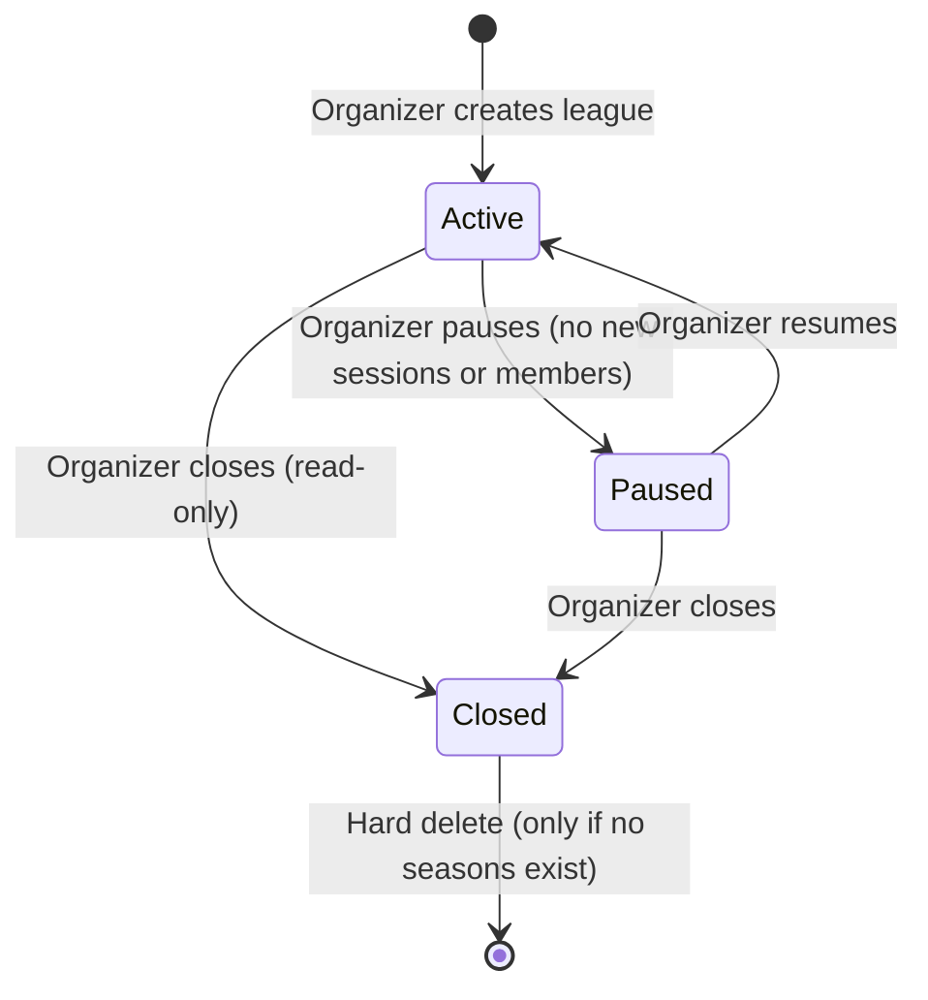
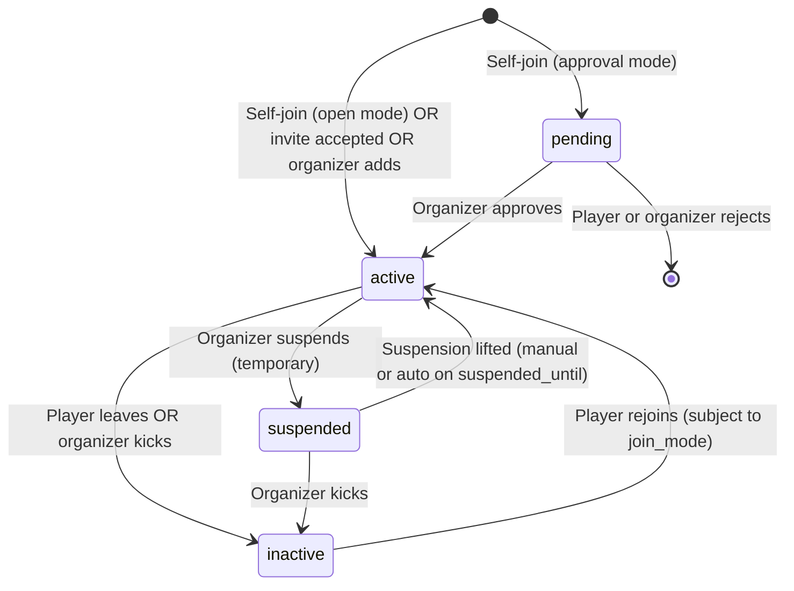
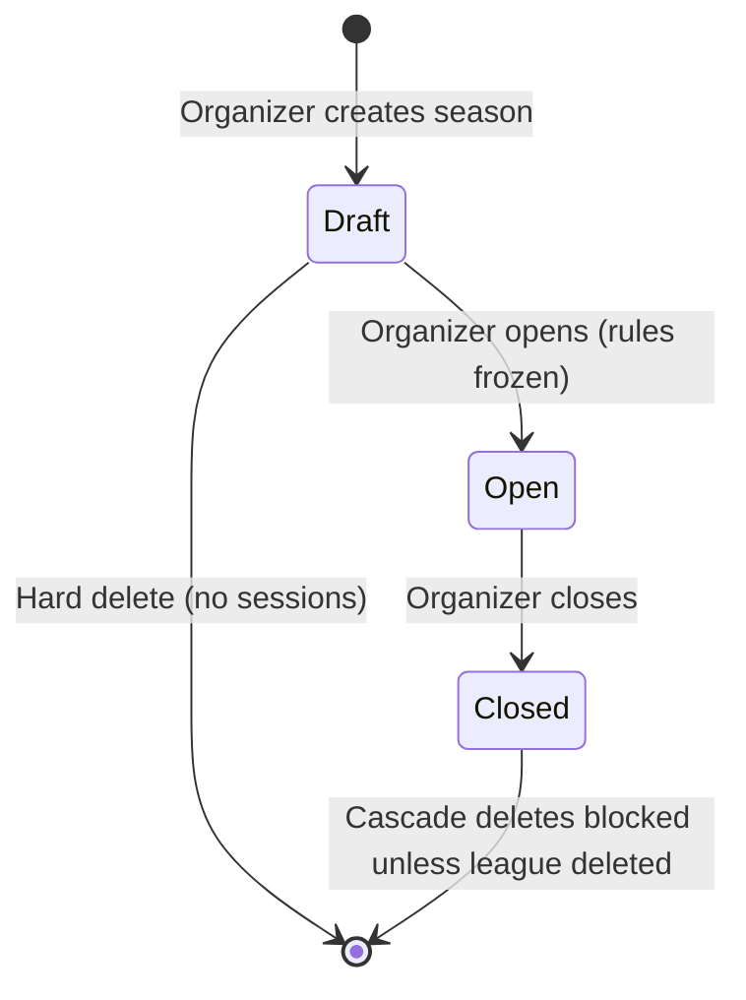
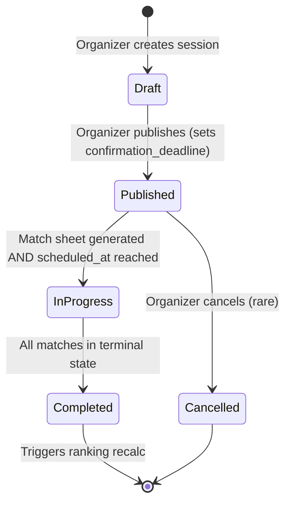

# Leagues, Seasons, Sessions

> Recurring competitive structure with three levels: league (permanent), season (time-bounded), session (one play date).

## Hierarchy

```
LEAGUE (permanent — has members and default rules)
  └── SEASON (e.g. "Winter 2026" — has frozen rules and ranking)
        └── SESSION (single play date — has confirmed players and matches)
              └── SESSION MATCH
```

A league is the permanent organizational unit; a season is one ranking cycle; a session is one match-night.

## League lifecycle



| State    | New members? | New seasons? | Members can play? | Public visible? |
| -------- | :----------: | :----------: | :---------------: | :-------------: |
| `active` |      ✅      |      ✅      |        ✅         |       ✅¹       |
| `paused` |      ❌      |      ❌      |        ✅²        |       ✅¹       |
| `closed` |      ❌      |      ❌      |        ❌         |       ✅¹       |

¹ Subject to `visibility` (`public` / `community` / `private`).
² Existing in-flight sessions remain playable.

## League creation

### Required fields

| Field        | Constraint                          |
| ------------ | ----------------------------------- |
| `name`       | 1–100 chars                         |
| `sport`      | `tennis` or `pickleball`            |
| `visibility` | `public`, `private`, or `community` |
| `join_mode`  | `open`, `invite_only`, `approval`   |

### Optional fields

| Field              | Default                                      | Notes                                                                                                           |
| ------------------ | -------------------------------------------- | --------------------------------------------------------------------------------------------------------------- |
| `description`      | empty                                        |                                                                                                                 |
| `logo_url`         | NULL                                         | Supabase Storage `league-logos/`                                                                                |
| `facility_id`      | NULL                                         | Anchors map placement and default session venue                                                                 |
| `surfaces`         | `{}`                                         | Surface preferences                                                                                             |
| `categories`       | `{}`                                         | Filtering metadata                                                                                              |
| `level`            | `open`                                       |                                                                                                                 |
| `network_id`       | NULL                                         | If set, visibility defaults to `community`. Must reference a `network` whose `network_type.code = 'community'`. |
| `default_rules`    | (see [ranking.md](./ranking.md#rules-shape)) | Cloned to each season at OPEN                                                                                   |
| `member_capacity`  | NULL                                         | Max active members; NULL = unlimited (per co-founder brief)                                                     |
| `waitlist_enabled` | `false`                                      | If true, joins past `member_capacity` go to waitlist                                                            |

### League capacity & member waitlist

When `member_capacity` is set and `waitlist_enabled = true`:

- The first `member_capacity` joins go to status `active`.
- Subsequent joins go to a league-level waitlist (separate `league_member_waitlist` table, mirrors `tournament_waitlist`).
- When an `active` member becomes `inactive` (leaves or is kicked), the next waitlist row is promoted automatically and notified.

When `waitlist_enabled = false` and capacity is reached, the join RPC returns `LEAGUE_FULL`.

**As built (20260730100300).** `member_capacity` is enforced in _both_ modes — until that migration, `waitlist_enabled = true` made the whole capacity condition false and overflow joined straight through as `active`, so switching the waitlist on switched the cap off.

A queued joiner is held at `league_members.status = 'pending'` (not a new `waitlisted` status) plus a `league_member_waitlist` row carrying the order. `pending` already means exactly this everywhere else — on the roster, excluded from `is_active_league_member` and from the ranking roster — so the organizer's existing Requests tab shows them with no client change; the queue row is what distinguishes "waiting for a seat" from "waiting for approval". `league_join` returns that pending row rather than raising, because a `RAISE` would roll back the queue row written in the same call.

Promotion is `tg_league_member_promote_waitlist`, mirroring `tg_session_presence_promote_waitlist`. On an `open` league the head of the queue is promoted to `active` (and the existing membership trigger sends the "you're in" notification); on `approval` / `invite_only` it stays `pending` for the organizer to confirm.

**Lifecycle coherence (20260730120000).** A suspension holds its seat: `suspended` counts against `member_capacity` everywhere (join, approve, promotion re-check), and the trigger fires on any permanent departure — `active → inactive` _or_ `suspended → inactive` — so a seat frees exactly once and a walk-in can never take a suspended member's place. Leaving or being removed while queued deletes the queue entry (no involuntary re-admission later); accepting an invite or being approved consumes it. The trigger independently skips any queue entry whose membership is no longer the `pending` hold, so a stale row can never eat a promotion slot. `league_approve_member` raises `LEAGUE_FULL` at capacity — the cap binds approvals like joins; only the invite-accept path bypasses it (the organizer already chose them).

Not yet surfaced: the mobile league screen has no capacity/waitlist editor and reads a queued player as a plain join request, so the copy says "request sent" rather than showing a queue position.

### Editing

`default_rules` edits apply to **future** seasons only — existing seasons retain their frozen `rules`. Edits to `name`, `description`, `logo_url`, `facility_id`, `categories`, etc. take immediate effect.

## Membership

### Join modes

| `join_mode`   | Self-join behavior                     | Member status on join |
| ------------- | -------------------------------------- | --------------------- |
| `open`        | Anyone meeting gates joins immediately | `active`              |
| `approval`    | Anyone meeting gates can request       | `pending`             |
| `invite_only` | Only pre-existing invite rows          | (n/a)                 |

Gates: optional `min_rating`, `max_rating`, `min_reputation` mirror the tournament fields.

### Member statuses

| Status      | Description                       | Can confirm sessions? | Counted in ranking? |
| ----------- | --------------------------------- | :-------------------: | :-----------------: |
| `pending`   | Awaiting approval                 |          ❌           |         ❌          |
| `active`    | Full member                       |          ✅           |         ✅          |
| `suspended` | Temporary block (with date range) |          ❌           | retains historical  |
| `inactive`  | Former member                     |          ❌           | retains historical  |

### Member transitions



### Mid-season impact

When a `member` transitions to `inactive` while a season is `open`:

- All ranking rows from completed sessions are preserved.
- Future session presence rows are auto-set to `declined`.
- Member is removed from any unsent match-sheet drafts (regenerate non-locked rows).
- `lt-update-attendance` recomputes `sessions_eligible` to exclude post-leave sessions, so participation % isn't unfairly hurt.

Standings rows follow one invariant (20260730120100): `season_rankings` = current roster ∪ result-holders, where a result is a terminal non-drill match or confirmed attendance at a completed session. `recalc_season_ranking` seeds and prunes with that same predicate (`season_ranking_population`), so a player who exits without results drops off the table, while a result that lands _after_ their exit (score entered the day after they withdrew) resurrects their row with the result tallied — without re-inviting them to future sessions, which stays governed by `season_ranking_roster`.

A member who becomes `inactive` during a season **cannot rejoin the same season**. They can rejoin once a new season starts (subject to `join_mode`).

### Suspension

Organizer-only. Reasons must be recorded in `suspended_reason`. The suspension applies until `suspended_until` (datetime, nullable for indefinite). The cron `lt-lift-suspensions` (hourly, `:40`) calls `lt_lift_expired_suspensions()`, which flips expired suspensions back to `active` and notifies the member. Built 20260730100500 — before that nothing in the database read `suspended_until`, so a "two week" suspension ran until an organizer lifted it by hand.

## Seasons

### Lifecycle



| State    | Sessions can be created? | Confirmations allowed? | Ranking visible? |
| -------- | :----------------------: | :--------------------: | :--------------: |
| `draft`  |            ❌            |           ❌           |        ❌        |
| `open`   |            ✅            |           ✅           |        ✅        |
| `closed` |            ❌            |           ❌           |  ✅ (snapshot)   |

### Opening a season

`season_open(season_id, version_was)`:

1. Verify caller is league organizer.
2. Verify season status is `draft`.
3. Verify `start_date <= today <= end_date` is achievable (warning if `end_date < today`; warn if `start_date` is more than 7 days in the past — organizer may still open with confirmation).
4. Merge `leagues.default_rules` with any `rules_override` passed to `season_create` (stored in draft as partial `seasons.rules` or merged only at open — see [data-model.md](./data-model.md#seasons)).
5. Set `rules_locked_at = now()`.
6. Status → `open`.
7. Notify all `active` members.

The frozen `rules` cannot be edited for the duration of the season. The intent is that a season's outcome is reproducible from its frozen rule set.

### Closing a season

`season_close(season_id, version_was)`:

1. Verify caller is league organizer.
2. Block if any session is `published` or `in_progress` (`SEASON_HAS_OPEN_SESSIONS`).
3. Force-recalc rankings.
4. Snapshot `season_rankings` to `seasons.final_standings`.
5. Status → `closed`. `closed_at = now()`.
6. Notify members with the final ranking.
7. Award badges:
   - `season_winner` to rank 1
   - `season_top_3` to ranks 2–3
   - `perfect_attendance` to anyone with `sessions_attended = sessions_eligible`

A closed season's `final_standings` is immutable. To "fix" a closed season, an admin (system 15) must reopen via SQL — there is no UI path.

### Season rules override (v2)

A season can diverge from league defaults via `rules_override` on **`season_create`** (jsonb merge at OPEN). Examples:

```json
{
  "pointWin": 12,
  "enableBonuses": true,
  "matchFormat": "two_of_three"
}
```

The override is merged on top of `default_rules` at OPEN; the result is stored in `seasons.rules`.

## Sessions

### Lifecycle



| State         | Confirmations? | Match sheet? |   Score entry?   | Visible to members? |
| ------------- | :------------: | :----------: | :--------------: | :-----------------: |
| `draft`       |       ❌       |      ❌      |        ❌        | ❌ (organizer only) |
| `published`   |       ✅       |     ✅¹      |        ❌        |         ✅          |
| `in_progress` |       ❌       |    locked    |        ✅        |         ✅          |
| `completed`   |       ❌       |    locked    | corrections only |         ✅          |
| `cancelled`   |       ❌       | (discarded)  |        ❌        | ✅ (informational)  |

¹ Sheet may be generated by organizer at any time after publish; defaults to "after confirmation deadline".

### Creating a session

```sql
SELECT session_create(season_id, payload);
```

Required:

| Field          | Constraint                       |
| -------------- | -------------------------------- |
| `name`         | 1–80 chars                       |
| `scheduled_at` | timestamptz; > now() at creation |
| `timezone`     | IANA tz                          |

Optional with defaults:

| Field                        | Default                                   |
| ---------------------------- | ----------------------------------------- |
| `duration_minutes`           | 90                                        |
| `facility_id` / `venue_name` | inherited from league                     |
| `capacity`                   | NULL (unlimited)                          |
| `rounds`                     | 1                                         |
| `formats_allowed`            | from `season.rules.formatsAllowed`        |
| `match_format`               | inherited from `season.rules.matchFormat` |
| `pairing_mode`               | `by_rank`                                 |
| `confirmation_deadline_at`   | `scheduled_at - 24h`                      |

### Publishing a session

`session_publish(session_id, deadline, version_was)`:

1. Verify draft status.
2. Verify `scheduled_at > now()`.
3. Set `confirmation_deadline_at` (defaults to `scheduled_at - 24h`).
4. Status → `published`, `published_at = now()`.
5. Insert `session_presence` rows for every `active` league member with status `pending`.
6. Notify all members: `session_published` (in-app + email).

### Guest invitations to sessions

The co-founder brief permits "ajouter un invité à une séance (hors classement) — option activable." Implementation:

- Per-session toggle `allow_guests` (default false).
- When enabled, the organizer can invite a non-member into a specific session via `session_invite_guest(session_id, user_id)`.
- The guest receives a `session_presence` row with `is_guest = true` (and `guest_invited_by` set).
- Guests participate in pairings and play matches normally.
- Guest match results **are not counted in the season ranking** — `recalc_season_ranking` skips matches where any player has `is_guest = true` for that session, and skips guest users entirely from the rankings table.
- Guests still receive reputation events from their matches (no-show, late-cancel, completion, ratings) so the casual-match reputation system applies uniformly.
- A guest can become a regular member later by joining the league through the normal `league_join` flow.

### Confirmations

Members respond via `session_confirm_presence(session_id, status, partner_id?)`:

- Status: `confirmed`, `declined`, or (rare) returns to `pending` via "I'll think about it".
- Optional `partner_id` for doubles pre-pairing (honored by `BALANCED_DOUBLES` algorithm — see [match-sheet.md](./match-sheet.md#balanced_doubles)).

Reminder cadence:

| Time                | Channel      | Action                                  |
| ------------------- | ------------ | --------------------------------------- |
| At publish          | Push + Email | "Confirm by `confirmation_deadline_at`" |
| 48h before deadline | Push         | "Reminder to confirm"                   |
| 6h before deadline  | Push + Email | "Last call to confirm"                  |
| At deadline         | Push         | "Confirmations closed" (organizer only) |

When the deadline passes, `lt-close-confirmations` cron flips remaining `pending` rows to `declined` (no penalty) and notifies the organizer with the final roster.

### Capacity & waitlist

If `capacity` is set:

- The first `capacity` confirmations get `confirmed`; further confirmations get `waitlisted` with `waitlist_position`.
- When a `confirmed` member declines (or is set to `declined` at deadline), the trigger `tg_session_presence_promote_waitlist` promotes the lowest `waitlist_position` row to `confirmed` and notifies them.
- Waitlist promotions can occur up to `confirmation_deadline_at`; after that, no more promotions.

### Match sheet generation

Triggered by organizer via `session_generate_sheet(session_id, version_was)` — typically at confirmation-deadline-pass.

Required preconditions:

- Status = `published`.
- `confirmed_count >= 2` (singles) or `>= 4` (doubles).
- All confirmed members satisfy the **league's** `min_rating` / `max_rating` / `min_reputation` gates if set (same columns as tournaments — see [data-model.md](./data-model.md#leagues)).

The full algorithm is specified in [match-sheet.md](./match-sheet.md).

### Locking a session

When `session_matches.scheduled_at <= now()` for the first match (or organizer manually starts), the session enters `in_progress` and:

- No new confirmations / declines / regenerations allowed.
- Score entry begins.
- Real-time updates broadcast on `session:{id}` channel.

### Completing a session

A session reaches `completed` when all of its `session_matches` are in a terminal state (`completed`, `walkover`, `retired`, `cancelled`) and at least one is non-cancelled. Trigger `tg_sessions_recompute_status` does this and queues `recalc_season_ranking(season_id)`.

Late score entries are accepted up to **48h after `scheduled_at`**. After 48h:

- Pending matches auto-set to `cancelled` (no points awarded).
- Submitted but unvalidated scores are retained but flagged for organizer attention.

Ranking is re-computed once at session completion, then once more if any score is corrected within the 48h window.

### Cancelling a session

`session_cancel(session_id, reason, version_was)`:

- Allowed in `draft`, `published`, `in_progress`.
- Sets `cancelled_at = now()`, `cancelled_reason`.
- Retains `session_matches` rows for audit; each match → `cancelled` (not deleted).
- Notifies confirmed members.
- A cancelled session does not contribute to rankings; `sessions_eligible` is decremented for all members.

### Rescheduling a session

`session_reschedule(session_id, new_scheduled_at, version_was)`:

- Allowed in `draft`, `published`.
- Shifts `confirmation_deadline_at` by the same delta.
- Notifies confirmed and pending members; their confirmations are preserved.

If reschedule occurs **less than 24h** before original start, the system regenerates the match sheet from scratch (all non-locked rows discarded) and members re-confirm because they may no longer be available.

## Session chat

Auto-created when session is `published`:

- `session:{id}:general` — all confirmed members + organizer.
- Per-doubles-team chat created when match sheet is generated and a doubles match is finalized.

Chat lifecycle follows [chat.md](../08-communications/chat.md).

## Calendar surfacing

Sessions appear in user calendar (system 12) for confirmed members:

- Calendar event title: `<League name> — <Session name>`.
- Time: `scheduled_at` to `scheduled_at + duration_minutes`.
- Location: `facility_id` coordinates or `venue_name`.
- Description: link back to the in-app session detail.
- iCal export uses the same shape; updates on reschedule / cancel.

## Ranking privacy

`leagues` has implicit ranking visibility derived from `visibility`:

| `visibility` | Ranking visible to                          |
| ------------ | ------------------------------------------- |
| `public`     | Everyone (guest + authenticated)            |
| `community`  | Active members of `network_id`              |
| `private`    | League organizers and active league members |

Member-level "hide my rank" (privacy mode) is **not** offered in v1; spec for v2 in [edge-cases.md](./edge-cases.md#privacy).

## League archival

Closed leagues are archived implicitly — they remain accessible but appear under "Archive" in the league index. There is no separate `archived` state for leagues (unlike tournaments) because closed leagues retain seasonal data members may want to revisit indefinitely.
