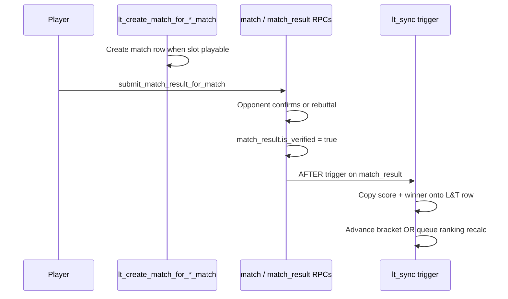

# Score Entry

> Shared rules for entering, validating, and disputing match scores in both tournaments and leagues.

## Architecture: match bridge (canonical)

Tournament and league matches **do not** use a parallel score-submission stack. They reuse the casual-match loop from [system 09](../09-matches/README.md):

```
tournament_matches / session_matches
        │ match_id (nullable FK)
        ▼
   public.match  +  match_participant  +  match_result
        │
        ▼
RegisterMatchScoreSheet → submit_match_result_for_match
                       → confirm_match_score / propose_rebuttal_score
```

| Path                    | Who          | How                                                                                                                                                                                                                                                                                                                           |
| ----------------------- | ------------ | ----------------------------------------------------------------------------------------------------------------------------------------------------------------------------------------------------------------------------------------------------------------------------------------------------------------------------- |
| **Play & score**        | Participants | When a slot becomes playable, `lt_create_match_for_*_match` creates (or reuses) a standalone `match` row. Players score through the existing match UI. When `match_result.is_verified` flips true, a trigger copies the verified result onto the L&T row and runs downstream logic (bracket advance or ranking recalc queue). |
| **Link existing match** | Participants | `attach_match_to_tournament_slot` links an already-verified casual match whose participants match the bracket slot. Same trigger path.                                                                                                                                                                                        |
| **Organizer override**  | Organizer    | `tournament_override_score` / `session_override_score` writes the authoritative result directly on the L&T row (and syncs or creates the linked `match` when needed). Used when players forget to submit or dispute resolution is needed.                                                                                     |

Implications:

- Player disputes and mutual confirmation follow [match lifecycle](../09-matches/match-lifecycle.md) rules on the linked `match` row — not `*_match_scores` rows.
- `tournament_match_scores` and `session_match_scores` exist in schema for **organizer overrides and audit** only in v1. They are **not** the player submission path.
- Reputation events and rating evolution fire from the verified `match_result`, same as casual play ([integrations.md §04–05](./integrations.md)).

See [data-model.md § Match bridge](./data-model.md#match-bridge) for DDL, RPCs, and triggers.

### Deferred: parallel L&T score RPCs (not v1)

An earlier draft specified `tournament_submit_match_score`, `*_validate_score`, and `*_dispute_score` writing to `*_match_scores`. That path is **not implemented** and is deferred unless product explicitly requires organizer-only validation without the casual-match flow.

## Score string canonical format

A canonical "score string" is stored on `tournament_matches.score` and `session_matches.score`. The same parser produces a canonical string from any accepted input.

### Tennis sets

```
6-4, 4-6, 7-6(5)
```

- Sets are separated by `, ` (comma-space).
- Each set is `<gamesA>-<gamesB>`.
- Tie-break in a set is appended as `(<loserPoints>)` immediately after the set; the winner of the tie-break is implied by which side has the higher game count.
- Super tie-break (10-point) used in lieu of a final set is rendered as `[10-7]` (square brackets, no internal space) to disambiguate from a 7-point set TB.

### Pickleball

```
11-8 to 11
11-8, 4-11, 11-9 to 11
15-12 to 15
21-19 to 21
```

The trailing `to <target>` indicates the game's target score. Multiple games in a best-of-N format are comma-separated.

### Modifiers

| Suffix | Meaning                                                             | Example             |
| ------ | ------------------------------------------------------------------- | ------------------- |
| ` RET` | Match retired by trailing player                                    | `6-4, 2-1 RET`      |
| ` W/O` | Walkover (opponent didn't appear)                                   | `W/O`               |
| ` DEF` | Default (forfeit by code violation)                                 | `DEF`               |
| ` INT` | Match interrupted (weather, injury, venue) — partial score retained | `6-4, 3-6, 4-3 INT` |

The `INT` modifier (from co-founder brief: "Score non terminé (ex: 6-4, 3-6, 4-3 pour un match interrompu)") records a match where neither side achieved the win threshold but the match cannot continue. The organizer then chooses one of three resolutions:

| Resolution       | Effect                                                                                                      |
| ---------------- | ----------------------------------------------------------------------------------------------------------- |
| `award_by_score` | Winner is the side with more sets (tennis) or more games at interrupt (pickleball); points awarded normally |
| `reschedule`     | Match status reverts to `pending`; new `scheduled_at` set                                                   |
| `void`           | Match status → `cancelled`; no points awarded; sets/games still recorded for history                        |

The chosen resolution is captured in the audit log alongside the original `INT` score string.

## Validators

Score validation for **player-entered** results runs through the existing casual-match pipeline (`packages/shared-services/src/matches/matchScoring.ts` and the match RPCs). The canonical string rules in this file define what gets **stored** on `match_result` / copied to `tournament_matches.score` / `session_matches.score`.

A dedicated `shared-utils/src/score/` module (pure functions, usable client-side for preview) is **optional follow-up** — not a blocker for v1. When extracted, the same rules run:

1. Client-side in `RegisterMatchScoreSheet` / organizer override sheets for immediate feedback.
2. Server-side in match result RPCs (already partially enforced today).
3. In `lt_sync_*_match_from_verified_result` when copying onto L&T rows.

### Tennis validator pseudocode

```typescript
function validateTennisScore(
  score: string,
  config: {
    matchFormat: 'one_set' | 'two_of_three' | 'three_of_five';
    gamesPerSet: number;
    finalSetTiebreak: 'none' | 'standard_7pt' | 'super_tb_10pt';
  }
): { ok: boolean; canonical?: string; winnerSide?: 'a' | 'b'; reason?: string } {
  const trimmed = score.trim();

  // Walkover / Default
  if (/^W\/O$/i.test(trimmed)) return { ok: true, canonical: 'W/O', winnerSide: undefined };
  if (/^DEF$/i.test(trimmed)) return { ok: true, canonical: 'DEF', winnerSide: undefined };

  // Retirement: strip ` RET` and require the partial score to be valid up to that point
  const retMatch = trimmed.match(/^(.+?)\s+RET$/i);
  const isRetired = retMatch !== null;
  const body = isRetired ? retMatch[1] : trimmed;

  const setStrings = body.split(',').map(s => s.trim());
  if (setStrings.length === 0) return fail('SCORE_FORMAT_INVALID', 'No sets');

  const setLimit = { one_set: 1, two_of_three: 3, three_of_five: 5 }[config.matchFormat];
  if (setStrings.length > setLimit)
    return fail('SCORE_RULES_INVALID', `Too many sets for ${config.matchFormat}`);

  let aSets = 0,
    bSets = 0;
  const canonicalSets: string[] = [];
  for (let i = 0; i < setStrings.length; i++) {
    const set = parseSet(setStrings[i], config, i === setStrings.length - 1);
    if (!set.ok) return set;
    if (set.winnerSide === 'a') aSets++;
    else if (set.winnerSide === 'b') bSets++;
    canonicalSets.push(set.canonical);
  }

  // Determine match winner (only if not retired and a side has reached the win threshold)
  const target = { one_set: 1, two_of_three: 2, three_of_five: 3 }[config.matchFormat];
  let winnerSide: 'a' | 'b' | undefined;
  if (!isRetired) {
    if (aSets === target) winnerSide = 'a';
    else if (bSets === target) winnerSide = 'b';
    else return fail('SCORE_RULES_INVALID', 'No side has won the match');
  } else {
    // Retired: winner is whichever side is currently leading
    if (aSets > bSets) winnerSide = 'a';
    else if (bSets > aSets) winnerSide = 'b';
    else {
      // Same set count; check the partial set if any
      // For simplicity, RET requires that one side is clearly "winning" — the winner is the side
      // with the most sets, breaking ties by game count of the in-progress set
      // (Implementation detail; full code in shared-utils)
    }
  }

  const canonical = canonicalSets.join(', ') + (isRetired ? ' RET' : '');
  return { ok: true, canonical, winnerSide };
}
```

`parseSet` enforces:

- Each set is two integers, hyphen-separated.
- Standard set: one side reaches `gamesPerSet`, the other has at most `gamesPerSet - 2` (or exactly `gamesPerSet - 1` if `gamesPerSet >= 6`, in which case the set goes to a 7-point tiebreak ending at `7-6`).
- Tiebreak notation `7-6(5)` requires the loser's tiebreak point count to be 0..5 (winner reached 7 with at least 2-point margin) or higher with margin (`7-6(8)` would be invalid; `9-7` is shown as `7-6(9)` representing extended tiebreak).
- Final-set super-tiebreak `[10-X]` is allowed only when `finalSetTiebreak = 'super_tb_10pt'` and only on the last set.
- Final set with `finalSetTiebreak = 'none'`: extends until a 2-game advantage (e.g., `8-6`).

### Pickleball validator pseudocode

```typescript
function validatePickleballScore(
  score: string,
  config: { matchFormat: 'pickleball_to_11' | 'pickleball_to_15' | 'pickleball_to_21' }
): { ok: boolean; canonical?: string; winnerSide?: 'a' | 'b'; reason?: string } {
  const target = { pickleball_to_11: 11, pickleball_to_15: 15, pickleball_to_21: 21 }[
    config.matchFormat
  ];
  // ... similar shape; each game is points-points, must have win-by-2 margin from `target`
  // Multi-game best-of-N is allowed; format default is single game
}
```

## Player submission flow (via match bridge)



Mutual confirmation and rebuttal behave exactly like casual matches — see [match lifecycle](../09-matches/match-lifecycle.md).

Alternatively, participants may **link** an already-verified casual match to a tournament bracket slot (`attach_match_to_tournament_slot`). League sessions will expose the same pattern in V9.

## Organizer override flow

When players do not submit, or after a match dispute stalls:

```sql
SELECT tournament_override_score(p_tournament_match_id, p_winner_registration_id, p_score, p_reason);
-- league equivalent (V9):
SELECT session_override_score(p_session_match_id, p_winner_team, p_score, p_reason);
```

The override RPC:

1. Validates caller is organizer/co-organizer.
2. Writes canonical `score`, `winner_*`, and terminal `status` on the L&T row.
3. Optionally inserts an audit row in `*_match_scores` (organizer-only trail).
4. Runs bracket advance or queues `recalc_season_ranking` for leagues.

## Disputes

Player disputes use the casual-match rebuttal flow on the linked `match` row. If unresolved, the organizer resolves via `*_override_score`. There is no separate `*_dispute_score` RPC in v1.

## Score → ranking / bracket effect

**Authoritative point rules** live in [ranking.md § Outcome matrix](./ranking.md#outcome-matrix-authoritative). This file only covers canonical score strings and statistics (`sets_won`, etc.).

Summary (league sessions only — tournaments advance bracket winners, no point table):

| Situation                                | Ranking points                                   | Reputation                 |
| ---------------------------------------- | ------------------------------------------------ | -------------------------- |
| BYE at sheet generation                  | `pointBye` to bye recipient                      | none                       |
| Completed match                          | per [ranking.md](./ranking.md#points-per-match)  | `match_completed`          |
| Walkover (played slot, opponent no-show) | `pointWalkoverWinner` / `pointWalkoverLoser`     | `match_no_show` on loser   |
| Retirement                               | `pointRetirementWinner` / `pointRetirementLoser` | `match_retired` on retiree |
| Session presence no-show (never played)  | `pointNoShow` / malus                            | `match_no_show`            |

## Sets won / sets lost on RET, W/O, DEF

- **RET**: count completed sets in their actual score; the in-progress set does not count for either side. So `6-4, 2-1 RET` → `aSets=1, bSets=0, aGames=8, bGames=5` for ranking statistics.
- **W/O**: counted as `aSets = target_sets, bSets = 0, aGames = target_sets * gamesPerSet, bGames = 0` for the winner. This standardizes statistics across walkover scenarios.
- **DEF**: same as W/O.

## Late entry

Scores can be submitted up to **48 hours** after the match's scheduled end (`scheduled_at + duration_minutes`). After 48h:

- For tournaments: organizer-only override; players see "Submission window closed".
- For leagues: same; the parent session also auto-flips `pending` matches to `cancelled` at the 48h mark.

## Score entry UI (mobile)

```
Match: Player A vs Player B
─────────────────────────────────────
[ Sets ] [ Pickleball ]   ← format toggle (read-only, derived from match config)

Set 1: [ 6 ] - [ 4 ]
Set 2: [ 4 ] - [ 6 ]
Set 3: [ 7 ] - [ 6 ]   [TB: 5]   ← TB sub-input appears when 7-6 entered

[ ] Retired (which side?)  [ A | B ]
[ ] Walkover (which side?)  [ A | B ]

Preview: "6-4, 4-6, 7-6(5)"  Winner: A
[Submit]
```

The preview line shows the canonical string that will be submitted, plus the derived winner. The Submit button is disabled until the entered score validates.

## Audit log

Organizer overrides and structural L&T mutations write to `leagues_tournaments_audit`. Verified casual-match results already audit through the match system. Override example:

```json
{
  "scope": "session_match",
  "entity_id": "...",
  "action": "override_score",
  "actor_id": "...",
  "payload_after": { "score": "...", "winner_team": "a", "status": "completed" }
}
```
