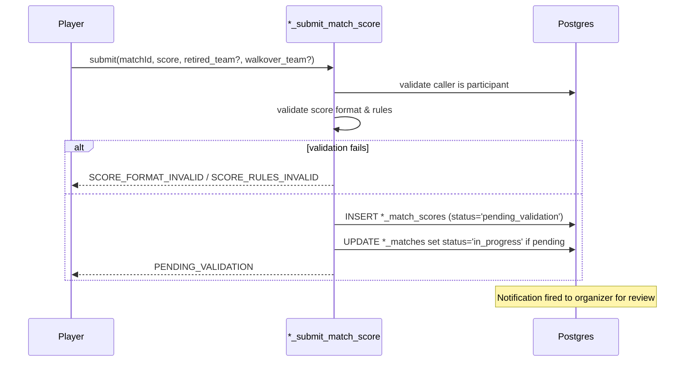

# Score Entry

> Shared rules for entering, validating, and disputing match scores in both tournaments and leagues.

## Score string canonical format

A canonical "score string" is stored on `tournament_matches.score` and `session_matches.score`. The same parser produces a canonical string from any accepted input.

### Tennis sets

```
6-4, 4-6, 7-6(5)
```

- Sets are separated by `, ` (comma-space).
- Each set is `<gamesA>-<gamesB>`.
- Tie-break in a set is appended as `(<loserPoints>)` immediately after the set; the winner of the tie-break is implied by which side has the higher game count.
- Super tie-break (10-point) used in lieu of a final set is rendered as `[10-7]` (square brackets, no internal space) to disambiguate from a 7-point set TB.

### Pickleball

```
11-8 to 11
11-8, 4-11, 11-9 to 11
15-12 to 15
21-19 to 21
```

The trailing `to <target>` indicates the game's target score. Multiple games in a best-of-N format are comma-separated.

### Modifiers

| Suffix | Meaning                                                             | Example             |
| ------ | ------------------------------------------------------------------- | ------------------- |
| ` RET` | Match retired by trailing player                                    | `6-4, 2-1 RET`      |
| ` W/O` | Walkover (opponent didn't appear)                                   | `W/O`               |
| ` DEF` | Default (forfeit by code violation)                                 | `DEF`               |
| ` INT` | Match interrupted (weather, injury, venue) — partial score retained | `6-4, 3-6, 4-3 INT` |

The `INT` modifier (from co-founder brief: "Score non terminé (ex: 6-4, 3-6, 4-3 pour un match interrompu)") records a match where neither side achieved the win threshold but the match cannot continue. The organizer then chooses one of three resolutions:

| Resolution       | Effect                                                                                                      |
| ---------------- | ----------------------------------------------------------------------------------------------------------- |
| `award_by_score` | Winner is the side with more sets (tennis) or more games at interrupt (pickleball); points awarded normally |
| `reschedule`     | Match status reverts to `pending`; new `scheduled_at` set                                                   |
| `void`           | Match status → `cancelled`; no points awarded; sets/games still recorded for history                        |

The chosen resolution is captured in the audit log alongside the original `INT` score string.

## Validators

All validators live in `shared-utils/src/score/` and are pure functions. The same validator runs:

1. Client-side, before submission, to give immediate feedback.
2. Server-side in the `*_submit_match_score` RPC.
3. In the `tg_score_validate_outcome` trigger as a backstop.

### Tennis validator pseudocode

```typescript
function validateTennisScore(
  score: string,
  config: {
    matchFormat: 'one_set' | 'two_of_three' | 'three_of_five';
    gamesPerSet: number;
    finalSetTiebreak: 'none' | 'standard_7pt' | 'super_tb_10pt';
  }
): { ok: boolean; canonical?: string; winnerSide?: 'a' | 'b'; reason?: string } {
  const trimmed = score.trim();

  // Walkover / Default
  if (/^W\/O$/i.test(trimmed)) return { ok: true, canonical: 'W/O', winnerSide: undefined };
  if (/^DEF$/i.test(trimmed)) return { ok: true, canonical: 'DEF', winnerSide: undefined };

  // Retirement: strip ` RET` and require the partial score to be valid up to that point
  const retMatch = trimmed.match(/^(.+?)\s+RET$/i);
  const isRetired = retMatch !== null;
  const body = isRetired ? retMatch[1] : trimmed;

  const setStrings = body.split(',').map(s => s.trim());
  if (setStrings.length === 0) return fail('SCORE_FORMAT_INVALID', 'No sets');

  const setLimit = { one_set: 1, two_of_three: 3, three_of_five: 5 }[config.matchFormat];
  if (setStrings.length > setLimit)
    return fail('SCORE_RULES_INVALID', `Too many sets for ${config.matchFormat}`);

  let aSets = 0,
    bSets = 0;
  const canonicalSets: string[] = [];
  for (let i = 0; i < setStrings.length; i++) {
    const set = parseSet(setStrings[i], config, i === setStrings.length - 1);
    if (!set.ok) return set;
    if (set.winnerSide === 'a') aSets++;
    else if (set.winnerSide === 'b') bSets++;
    canonicalSets.push(set.canonical);
  }

  // Determine match winner (only if not retired and a side has reached the win threshold)
  const target = { one_set: 1, two_of_three: 2, three_of_five: 3 }[config.matchFormat];
  let winnerSide: 'a' | 'b' | undefined;
  if (!isRetired) {
    if (aSets === target) winnerSide = 'a';
    else if (bSets === target) winnerSide = 'b';
    else return fail('SCORE_RULES_INVALID', 'No side has won the match');
  } else {
    // Retired: winner is whichever side is currently leading
    if (aSets > bSets) winnerSide = 'a';
    else if (bSets > aSets) winnerSide = 'b';
    else {
      // Same set count; check the partial set if any
      // For simplicity, RET requires that one side is clearly "winning" — the winner is the side
      // with the most sets, breaking ties by game count of the in-progress set
      // (Implementation detail; full code in shared-utils)
    }
  }

  const canonical = canonicalSets.join(', ') + (isRetired ? ' RET' : '');
  return { ok: true, canonical, winnerSide };
}
```

`parseSet` enforces:

- Each set is two integers, hyphen-separated.
- Standard set: one side reaches `gamesPerSet`, the other has at most `gamesPerSet - 2` (or exactly `gamesPerSet - 1` if `gamesPerSet >= 6`, in which case the set goes to a 7-point tiebreak ending at `7-6`).
- Tiebreak notation `7-6(5)` requires the loser's tiebreak point count to be 0..5 (winner reached 7 with at least 2-point margin) or higher with margin (`7-6(8)` would be invalid; `9-7` is shown as `7-6(9)` representing extended tiebreak).
- Final-set super-tiebreak `[10-X]` is allowed only when `finalSetTiebreak = 'super_tb_10pt'` and only on the last set.
- Final set with `finalSetTiebreak = 'none'`: extends until a 2-game advantage (e.g., `8-6`).

### Pickleball validator pseudocode

```typescript
function validatePickleballScore(
  score: string,
  config: { matchFormat: 'pickleball_to_11' | 'pickleball_to_15' | 'pickleball_to_21' }
): { ok: boolean; canonical?: string; winnerSide?: 'a' | 'b'; reason?: string } {
  const target = { pickleball_to_11: 11, pickleball_to_15: 15, pickleball_to_21: 21 }[
    config.matchFormat
  ];
  // ... similar shape; each game is points-points, must have win-by-2 margin from `target`
  // Multi-game best-of-N is allowed; format default is single game
}
```

## Submission flow



A second submission by the **opponent** with a _matching_ score automatically validates without organizer review (mutual confirmation):

- If both submitted scores have the same canonical form → both rows transition to `validated`, the match's `score`, `winner_team`, and `status='completed'` are populated, and the organizer is notified for awareness only.
- If they differ → both rows remain `pending_validation`, the match is flagged `disputed`, the organizer is alerted with both submissions side-by-side.

## Validation flow (organizer)

`*_validate_score(score_id, accept boolean, reason?)`:

- `accept = true`: row → `validated`. Match status set per the score (`completed`, `walkover`, `retired`). Other pending rows for the same match are auto-rejected with reason `SCORE_SUPERSEDED`.
- `accept = false`: row → `rejected`, `rejection_reason` set. Player may resubmit; match remains in `in_progress`.

Organizer can also override directly:

```sql
SELECT *_override_score(match_id, score, winner_team, reason);
```

This inserts a `score_validation_status = 'validated'` row with `submitted_by = validated_by = organizer_id`, sets the match's score and status, and writes an audit row. Used for "I watched the match, here's the result" — common when both players forget to submit.

## Disputes

A player who disagrees with the opponent's submission invokes `*_dispute_score(match_id, reason)`. The match's status flips to `disputed` and the organizer is alerted. Disputes are resolved by organizer override.

## Score → ranking effect

The translation from a validated score to ranking points is in [ranking.md](./ranking.md#points-per-match).

For BYE matches (already inserted with `status='walkover'`), no score is entered; ranking gets `pointLoss` (participation) per [ranking.md](./ranking.md#bye-treatment).

For walkover (opponent no-show): winner gets `pointWin`, opponent gets `pointNoShow` (-5 default). A reputation event `match_no_show` (-50) is also emitted for the no-show player.

For retirement: winner gets `pointWin`, retiring player gets `pointLoss` (participation, since they at least started). Reputation event `match_retired` (-3) emitted for the retiree (configurable in `reputation_config`).

## Sets won / sets lost on RET, W/O, DEF

- **RET**: count completed sets in their actual score; the in-progress set does not count for either side. So `6-4, 2-1 RET` → `aSets=1, bSets=0, aGames=8, bGames=5` for ranking statistics.
- **W/O**: counted as `aSets = target_sets, bSets = 0, aGames = target_sets * gamesPerSet, bGames = 0` for the winner. This standardizes statistics across walkover scenarios.
- **DEF**: same as W/O.

## Late entry

Scores can be submitted up to **48 hours** after the match's scheduled end (`scheduled_at + duration_minutes`). After 48h:

- For tournaments: organizer-only override; players see "Submission window closed".
- For leagues: same; the parent session also auto-flips `pending` matches to `cancelled` at the 48h mark.

## Score entry UI (mobile)

```
Match: Player A vs Player B
─────────────────────────────────────
[ Sets ] [ Pickleball ]   ← format toggle (read-only, derived from match config)

Set 1: [ 6 ] - [ 4 ]
Set 2: [ 4 ] - [ 6 ]
Set 3: [ 7 ] - [ 6 ]   [TB: 5]   ← TB sub-input appears when 7-6 entered

[ ] Retired (which side?)  [ A | B ]
[ ] Walkover (which side?)  [ A | B ]

Preview: "6-4, 4-6, 7-6(5)"  Winner: A
[Submit]
```

The preview line shows the canonical string that will be submitted, plus the derived winner. The Submit button is disabled until the entered score validates.

## Audit log

Every score submission, validation, rejection, and override produces an audit row with:

```json
{
  "scope": "session_match",
  "entity_id": "...",
  "action": "submit_score" | "validate_score" | "reject_score" | "override_score" | "dispute_score",
  "actor_id": "...",
  "payload_after": { "score": "...", "winner_team": "a", "status": "..." }
}
```
