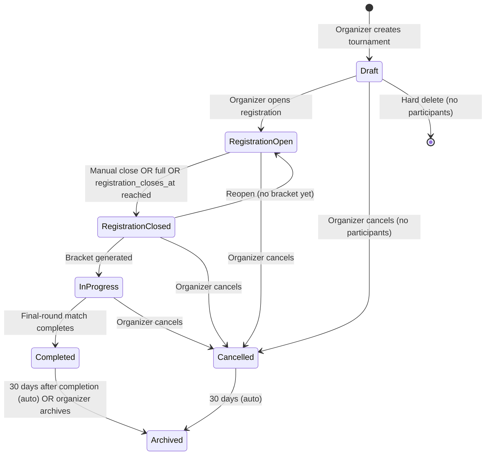
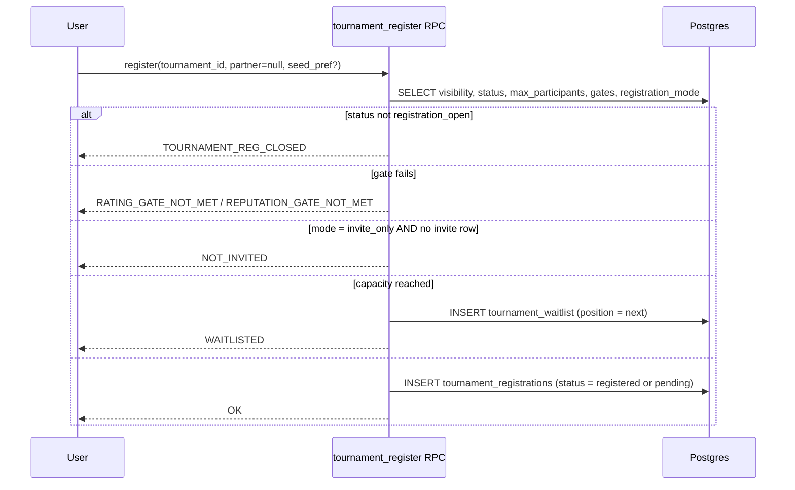

# Tournaments

> Single-event competition with fixed bracket, one winner, defined participants.

This file specifies the tournament-level lifecycle. Bracket construction and per-match management live in [tournament-bracket.md](./tournament-bracket.md). Score entry rules are shared with leagues in [score-entry.md](./score-entry.md).

## Lifecycle



The `cancelled` state was missing from the V1 spec; it is now a first-class state. `archived` exists so completed/cancelled tournaments stop appearing in active feeds without losing data.

### State definitions

| State                 | Description                                                    | User-visible label (en/fr)                        |
| --------------------- | -------------------------------------------------------------- | ------------------------------------------------- |
| `draft`               | Created, not visible to non-organizers                         | "Draft" / "Brouillon"                             |
| `registration_open`   | Accepting registrations                                        | "Open for registration" / "Inscriptions ouvertes" |
| `registration_closed` | Capacity reached or manually closed; bracket not yet generated | "Registration closed" / "Inscriptions fermées"    |
| `in_progress`         | Bracket exists, matches active                                 | "In progress" / "En cours"                        |
| `completed`           | Final match decided                                            | "Completed" / "Terminé"                           |
| `cancelled`           | Cancelled by organizer                                         | "Cancelled" / "Annulé"                            |
| `archived`            | Read-only historical record                                    | "Archived" / "Archivé"                            |

### Allowed transitions and gates

| From → To                                   | Trigger                                                                      | Gate                                              |
| ------------------------------------------- | ---------------------------------------------------------------------------- | ------------------------------------------------- |
| `draft` → `registration_open`               | `tournament_open_registration`                                               | All required fields present; `start_date > now()` |
| `draft` → `cancelled`                       | `tournament_cancel`                                                          | —                                                 |
| `registration_open` → `registration_closed` | `tournament_close_registration` OR full OR `registration_closes_at <= now()` | —                                                 |
| `registration_closed` → `registration_open` | `tournament_reopen_registration` (organizer)                                 | `bracket_locked_at IS NULL` AND no matches exist  |
| `registration_closed` → `in_progress`       | `tournament_generate_bracket`                                                | `participant_count >= 2`                          |
| `*` → `cancelled`                           | `tournament_cancel`                                                          | Cannot cancel from `completed` or `archived`      |
| `in_progress` → `completed`                 | Final match completes (trigger)                                              | All other matches in terminal state               |
| `completed` → `archived`                    | `tournament_archive` OR cron after 30 days                                   | —                                                 |
| `cancelled` → `archived`                    | Cron after 30 days                                                           | —                                                 |

`registration_closes_at` is honored by the `lt-close-tournament-registration` cron in addition to the enum-based check, so a busy organizer doesn't have to manually close. (The session-side `lt-close-confirmations` cron is a separate job covering session confirmation deadlines.)

## Creation

### Required fields

| Field              | Constraint                           |
| ------------------ | ------------------------------------ |
| `name`             | 1–100 chars                          |
| `sport`            | `tennis` or `pickleball`             |
| `start_date`       | > now() at creation                  |
| `end_date`         | >= `start_date`                      |
| `max_participants` | `4`, `8`, `16`, `32`, `64`, or `128` |

`64` and `128` brackets are valid but UI-tagged as "Large bracket" because the mobile bracket viewer needs to chunk-render and the PDF export switches from one-page to multi-page. v1 ships up to `32`; `64` and `128` are enabled in v1.1 once the chunked renderer is shipped.

### Optional fields with defaults

| Field                    | Default                                                   | Notes                                                          |
| ------------------------ | --------------------------------------------------------- | -------------------------------------------------------------- |
| `visibility`             | `private`                                                 | `public` shows in directory; `community` requires `network_id` |
| `registration_mode`      | `open`                                                    |                                                                |
| `registration_opens_at`  | now()                                                     |                                                                |
| `registration_closes_at` | `start_date - 24h`                                        |                                                                |
| `bracket_type`           | `single_elimination`                                      | `double_elimination` is v2                                     |
| `match_format`           | `two_of_three` (tennis) / `pickleball_to_11` (pickleball) | sport-aware default                                            |
| `games_per_set`          | `6` (tennis); not used for pickleball                     |                                                                |
| `final_set_tiebreak`     | `super_tb_10pt` (tennis); n/a (pickleball)                |                                                                |
| `entry_format`           | `singles`                                                 | `doubles` and `mixed_doubles` available v1.1                   |
| `seeding_enabled`        | `true`                                                    |                                                                |
| `max_seeds`              | `4`                                                       | `0`, `2`, `4`, or `8`                                          |
| `min_rating`             | NULL                                                      | Floor on participant rating                                    |
| `max_rating`             | NULL                                                      | Cap on participant rating                                      |
| `min_reputation`         | NULL                                                      | Floor on participant reputation score                          |
| `categories`             | `{}`                                                      | Filtering metadata (junior/senior/etc.)                        |

### Editable fields by state

| Field                                                                                 | `draft` | `registration_open` | `registration_closed` | `in_progress` | `completed` |
| ------------------------------------------------------------------------------------- | :-----: | :-----------------: | :-------------------: | :-----------: | :---------: |
| `name`, `description`, `logo_url`                                                     |   ✅    |         ✅          |          ✅           |      ✅       |     ✅      |
| `visibility`                                                                          |   ✅    |         ✅          |          ✅           |      ✅       |     ❌      |
| `categories`, `level`, `surface`                                                      |   ✅    |         ✅          |          ✅           |      ❌       |     ❌      |
| `registration_mode`, `registration_*_at`                                              |   ✅    |         ✅          |          ❌           |      ❌       |     ❌      |
| `start_date`, `end_date`                                                              |   ✅    |         ✅          |          ✅           |      ✅¹      |     ❌      |
| `max_participants`                                                                    |   ✅    |         ❌          |          ❌           |      ❌       |     ❌      |
| `bracket_type`, `match_format`, `games_per_set`, `final_set_tiebreak`, `entry_format` |   ✅    |         ❌          |          ❌           |      ❌       |     ❌      |
| `min_rating`, `max_rating`, `min_reputation`                                          |   ✅    |         ✅¹         |          ❌           |      ❌       |     ❌      |
| `facility_id`, `venue_*`                                                              |   ✅    |         ✅          |          ✅           |      ✅       |     ❌      |
| `network_id`                                                                          |   ✅    |         ❌          |          ❌           |      ❌       |     ❌      |

¹ Requires impactful-change confirmation dialog (mirrors [match-creation.md](../09-matches/match-creation.md#impactful-change-confirmation)) and triggers `tournament_updated` notifications to participants.

Tightening `min_rating`/`max_rating` after registrations exist requires the organizer to either grandfather affected registrations or disqualify them with notice.

**App-side freeze once out of draft (co-founder direction):** the mobile edit wizard treats `name`, `description` and `min_rating` as the tournament's identity — the terms registrants signed up under — and locks them (read-only) the moment the tournament leaves `draft`. Logo, rules, visibility, dates, location and prize stay editable per the matrix above. The `tournament_update` RPC still technically permits `name`/`description` edits in later states (kept for admin/support), so this is currently a client-side rule, not a server gate.

## Registration

### Modes

| Mode          | Behavior                                                                  |
| ------------- | ------------------------------------------------------------------------- |
| `open`        | Authenticated player meeting gates → status `registered` immediately      |
| `invite_only` | Organizer creates registration row directly; player accepts to confirm    |
| `approval`    | Player creates registration with status `pending`; organizer must approve |

### Shareable invite links

In addition to the modes above, the organizer can mint **tokenized invite links** at any time (per the co-founder brief, "Lien : L'organisateur peut partager un lien pour rejoindre le tournoi"). A link:

- Is a single row in `tournament_invite_links` with a 32-char URL-safe `token`.
- Has an optional `max_uses` and `expires_at`.
- Bypasses `registration_mode` — anyone with a valid link is treated as if they were invited (status `registered` immediately on use, even when the tournament's registration mode is `approval`).
- **Stays active until the bracket is published** (co-founder direction): the link admits new players through both `registration_open` and `registration_closed`, and only stops once the bracket is generated (`bracket_locked_at IS NOT NULL` → status `in_progress`). Closing registration ends public self-registration but not link-based late entry, so an organizer can hand-pick stragglers by link right up to bracket publication. `tournament_join_via_invite` enforces this window; the free/self-serve `tournament_register` still closes with the registration window.
- Can be revoked at any time by setting `revoked_at`.
- Has a label so the organizer can rotate links per audience ("Friends list", "Tennis Canada members", etc.) and revoke selectively.

URL shapes:

- Web: `https://app.rallia.app/{locale}/tournaments/join?t={token}`
- Mobile deep-link: `rallia://{sport}/tournaments/join?t={token}`

A guest tapping a link is sent through the standard sign-up flow first, then auto-registered into the tournament. This pattern mirrors the casual-match shareable-link growth hack ([principles §1](../principles.md#1-intrinsic-virality)).

### Flow (singles)



### Flow (doubles)

A doubles entry consists of **two `tournament_registrations` rows sharing one `partnership_id`** (UUID generated server-side).

1. Player A invokes `tournament_register(tid, partner_id=B)`.
2. Server creates two pending rows; B receives `tournament_partner_invite` notification.
3. B accepts → both rows transition to `registered`. B declines → both rows are deleted.
4. Either partner withdrawing dissolves the partnership: the remaining player has 24h to find a new partner before being moved to waitlist (or withdrawn if waitlist is also empty). Notification: `tournament_partner_withdrew`.

### Waitlist

- FIFO ordered by `tournament_waitlist.position` (1-based, dense — gaps closed by trigger when position deleted).
- Promotion is automatic on confirmed-player withdraw: trigger reads next waitlist row, inserts a `tournament_registrations` row, deletes (or marks promoted) the waitlist row, sends `tournament_waitlist_promoted` notification.
- Players see their current position on the tournament page and are notified whenever their position changes.

### Withdrawals

| Time                                                    | Effect                                                                                                                                                                                            |
| ------------------------------------------------------- | ------------------------------------------------------------------------------------------------------------------------------------------------------------------------------------------------- |
| Before bracket generated                                | Row deleted (singles) or partnership dissolved (doubles); waitlist promotes                                                                                                                       |
| After bracket generated, before opponent's match starts | Row marked `withdrawn`; bracket position assigned to a BYE; opponent advances; reputation event `match_no_show` (-50) NOT emitted (legitimate withdrawal) but `tournament_withdrew` event (-3) is |
| During scheduled match window                           | Counts as a no-show — match status `walkover`, opponent advances, reputation event `match_no_show` (-50)                                                                                          |

The `tournament_withdrew` reputation event has impact `-3` (decays per the standard formula in [reputation-calculation.md](../05-reputation/reputation-calculation.md#time-decay)). It is configured in `reputation_config` so it can be tuned without code changes.

### Disqualification

Organizer-initiated, used for code-of-conduct violations.

- Status → `disqualified`. Same bracket effect as withdrawal **after** bracket generation, plus reputation event `report_upheld` (-15).
- Audit row recorded with `payload_after.reason`.

## Cancellation

Organizer can cancel from any non-terminal state.

| Source state          | Side effects                                                                                                               |
| --------------------- | -------------------------------------------------------------------------------------------------------------------------- |
| `draft`               | None                                                                                                                       |
| `registration_open`   | Notify all `registered`/`pending`/`waitlisted` users                                                                       |
| `registration_closed` | Same as above                                                                                                              |
| `in_progress`         | Same as above + close all `pending`/`in_progress` matches as `cancelled`; partial results retained for organizer reference |

A cancelled tournament cannot be reopened. To run "the same" tournament again, the organizer creates a new one and may invite previous registrants in bulk via the "Re-invite from cancelled" button on the cancelled tournament's page.

`cancelled_reason` (free text, max 500 chars, multi-language) is included in the cancellation notification.

## Reschedule

Distinct from cancellation. Allowed in `registration_open`, `registration_closed`, and `in_progress`.

```sql
SELECT tournament_reschedule(p_tournament_id, p_new_start, p_new_end, p_version_was);
```

Effects:

- Updates `start_date`, `end_date`.
- Each `pending` match has its `scheduled_at` shifted by the same delta (preserves relative scheduling).
- All registered participants receive `tournament_rescheduled` notification with the delta and the impacted matches.
- A withdrawal that occurs within 24h of a _post-reschedule_ match start does **not** incur late-cancellation penalty if `host_edited_at` (i.e., `tournaments.updated_at`) is more recent than the participant's join — mirrors the [`host_edited_at` exception](../09-matches/match-lifecycle.md#host_edited_at--penalty-exception-for-host-edits).

## Tournament chat

Auto-created by trigger when bracket is generated:

- One channel `tournament:{id}:general` for all participants and co-organizers.
- Per-doubles-team chat created when partnership confirmed.
- Per-match chat created when match becomes `pending` with two known opponents (excludes BYEs).

Chat lifecycle follows [chat.md](../08-communications/chat.md). Messages persist after tournament archives.

## Public discovery

Tournaments with `visibility = 'public'` appear in:

- Sport universe home feed under the "Upcoming events" carousel.
- Player Directory's "Events" filter (system 06).
- Interactive Map: tournament marker at `facility_id`'s coordinates if set, otherwise hidden from map.
- Web `/tournaments` index page (system 10 club portal).

## Data displayed on the tournament page

The mobile and web tournament page displays:

```
┌─────────────────────────────────────────────┐
│ [logo] Tournament name                      │
│ Sport · Format · Surface · Level · Categories│
│ Status pill                                  │
├─────────────────────────────────────────────┤
│ Dates: Apr 10 – Apr 12, 2026                │
│ Venue: Stade IGA, Court 5                   │
│ Organizer: Jean D. (badge)                  │
├─────────────────────────────────────────────┤
│ [Tabs: Bracket | Participants | Info | Audit*] │
│   * audit only shown to organizer            │
├─────────────────────────────────────────────┤
│ CTA: Register / View Bracket / Score Entry  │
└─────────────────────────────────────────────┘
```

UX details in [mobile-ux.md](./mobile-ux.md#tournament-screens).

## Completion

When the final-round match transitions to `completed`/`walkover`/`retired`:

1. Trigger `tg_tournaments_recompute_status` sets `tournaments.status = 'completed'`.
2. Winner badge `tournament_winner` awarded (system 13).
3. Runner-up badge `tournament_finalist` awarded.
4. PostHog event `tournament_completed` emitted with properties `{tournament_id, winner_id, participant_count, sport}`.
5. All participants receive `tournament_completed` notification (in-app + email).
6. PDF export of bracket becomes available to all participants and the public if visibility = `public`.

## Export

| Format | Contents                                                                                                               |
| ------ | ---------------------------------------------------------------------------------------------------------------------- |
| PDF    | Bracket diagram with all results, final standings, sponsorship slots                                                   |
| CSV    | Participants list with seed, final-round-reached, win/loss record (organizer-only)                                     |
| iCal   | Per-participant: each scheduled match as a calendar event (consumed by [12-calendar](../12-calendar/external-sync.md)) |

PDF generation is invoked by the `lt-export-bracket-pdf` edge function and stored in `tournament-exports` Supabase Storage bucket with a signed-URL TTL of 7 days.
