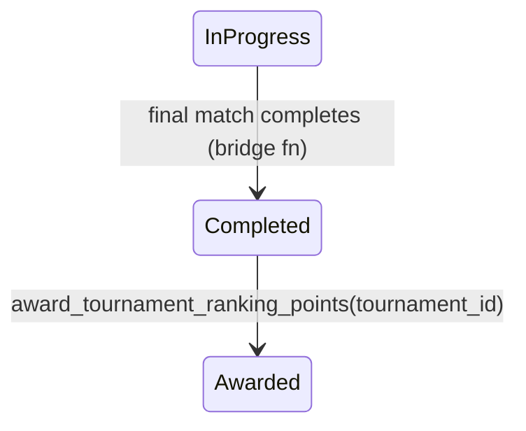

# Tournament ranking — "Circuit Rallia" (v1 spec)

User-facing name decided 2026-07-14: the board is the **Circuit Rallia** (tab:
"Circuit Rallia"), and **points Rallia** is the currency earned on it — "Points
Rallia" alone read as a loyalty program, not a competition. "Circuit" is how
Québec racquet sports already name a season of tournaments with a points
ranking (Tennis Québec circuits), and it's identical in FR/EN. Internal
identifiers (tables, RPCs, i18n keys) keep the `tournament_ranking` naming.

Status: draft · Owner: Mathis / cofounder · Last updated: 2026-07-26 (rev 5, rolling 52-week window)

> **Pricing in §4 and §5 is superseded.** The tier ladder and base curve below
> describe the July-14 design. Live pricing (continuous level multiplier, the
> 0.2 snap, flat participation, round-of-N rungs) is documented in
> [`docs/circuit-rallia-points.md`](../../docs/circuit-rallia-points.md), which
> is the source of truth. Everything else here tracks the live system.

A points-based ranking layered on top of tournaments. Players earn **Points
Rallia** by entering and advancing in tournaments; points accumulate over a
**rolling 52-week window** into one leaderboard per sport. This is a **ranking**
(achievement/engagement), separate from the skill **rating** used for
matchmaking — the rating is never derived from or affected by this system.

Scope: **tournaments only**. Leagues already have a per-season points table
(`season_rankings` + `recalc_season_ranking`) and will fold into the same
currency later; a league season's award lands with a completion date like any
other result, so the rolling window covers it with no extra machinery.

---

## 1. Decisions (validated 2026-07-14)

| Topic                   | Decision                                                                                                                                                                                                                                                                            |
| ----------------------- | ----------------------------------------------------------------------------------------------------------------------------------------------------------------------------------------------------------------------------------------------------------------------------------- |
| Time window             | **Rolling 52 weeks**, no reset (revised 2026-07-26, was seasons that reset 2×/year). Seasons survive as a browsable **archive** on the same Apr 1 / Oct 1 calendar.                                                                                                                 |
| Participation weighting | **Balanced** — a modest floor for showing up, bulk of points at finalist/champion                                                                                                                                                                                                   |
| Boards                  | **One common board per sport** (all levels together) → 2 boards. The tier weighting sorts ability; strong players top the board by winning large, high-strength tournaments. Level is snapshotted per result to power an optional "filter to my level" view — not a separate board. |
| Tier (point weight)     | **Computed**, not organizer-set. Now draw size × the tournament's `min_rating` level multiplier (see `docs/circuit-rallia-points.md`); §4's field-strength formula is superseded.                                                                                                   |

Defaults chosen while specifying (flagged for confirmation in §10):

- **(C)** The DB `skill_level` enum has 4 values; `professional` folds into
  **advanced** (used only for the optional level filter).
- **(D)** Placement tiers that earn distinct points: Champion / Finalist /
  Semifinal / Quarterfinal / Participated (everything earlier is flat).
- **(E)** Concrete tier and points numbers proposed in §4 and §5 — tunable.
- **(F)** Anti-farming: only a player's **best 8 results** in the rolling
  window count toward their board total (§5); tournaments with **fewer than 8
  entries award participation points only** (§4) — confirmed 2026-07-14. This aligns exactly
  with the tier cutoffs: `local` (n < 8) is participation-only by definition;
  placement points exist only at `regional`/`vedette`.
- **(G)** **Zero-win floor** — confirmed 2026-07-14: losing your first **real**
  (non-BYE) match pays `participated` regardless of exit round; any placement
  above participation requires **at least one real win**. Without this, an
  8-entry bracket has no round below the quarterfinal (every entrant would earn
  ≥ 90 pts), and a BYE + first-loss in a sparse 16-bracket would pay
  quarterfinal points with zero wins. (ATP treats byes the same way.)

Resolved during discussion: boards are **per sport only** (no level partition);
the earlier "board anchor" and unrated-player-bucket questions are moot —
every entrant lands on their sport's one board.

---

## 2. Data model

Two new tables plus one column on `tournaments`, and a certified-organizer flag
on `player`. All new tables get **RLS enabled** (public/authenticated `SELECT`;
no client writes — only the award function, `security definer`, writes) and
**explicit GRANTs** (Data-API deprecation).

### `player.is_certified_organizer` (new column) — eligibility gate

`is_certified_organizer boolean NOT NULL DEFAULT false`, plus audit columns
`certified_organizer_at`, `certified_organizer_by` (→ `profile`), and
`certified_organizer_notes`. Granted by an admin via
`admin_certify_organizer(player, bool, notes)` — mirrors the existing
community-network certification (`network.is_certified` / `admin_certify_network`).
Only a certified organizer's tournaments award Points Rallia (§7 step 1b).
Migration `20260715120000_tournament_ranking_certified_organizer_gate.sql`.

### `tournaments.completed_at` (new column)

The completion flip (`supabase/migrations/20260510170009_lt_tournament_match_bridge.sql`,
"Final completion → tournament completed") sets only `status`/`updated_at`
today, and `updated_at` is later overwritten by archiving. Season resolution
needs a stable completion time:

- Add `completed_at timestamptz` to `tournaments`.
- Set it in the same `UPDATE` that flips `status = 'completed'`.
- Backfill existing completed/archived tournaments from `updated_at`
  (best available proxy — noted for the staging backfill).

### `ranking_season` — the archive calendar

One row per half-year. Boundaries are **midnight America/Toronto**, stored as
timestamptz.

**Revised 2026-07-26:** seasons no longer scope the live board. They are kept,
still seeded, and still stamped on every ledger row, so a season's **final
standings stay browsable** after it closes. The live board is the rolling
window (§6).

| Column      | Type        | Notes                                                                                      |
| ----------- | ----------- | ------------------------------------------------------------------------------------------ |
| `id`        | uuid pk     |                                                                                            |
| `code`      | text unique | `<year>-SS` \| `<year>-FW`, keyed by **start** year (e.g. `2026-FW` = Oct 2026 → Mar 2027) |
| `label`     | text        | "Printemps/Été 2026", "Automne/Hiver 2026"                                                 |
| `starts_at` | timestamptz | inclusive                                                                                  |
| `ends_at`   | timestamptz | exclusive                                                                                  |

Two seasons per year:

- **Spring/Summer** `<year>-SS`: Apr 1 `<year>` → Oct 1 `<year>`.
- **Fall/Winter** `<year>-FW`: Oct 1 `<year>` → Apr 1 `<year+1>` (spans the
  year boundary; coded by its start year).

Seed the current season plus at least the next two, **and historical seasons
back to the earliest `tournaments.completed_at`** so the backfill (§11) always
finds a covering season and old seasons are browsable. The award function must
**fail loudly** (raise) if no season row covers the completion time — never
award into a silent NULL season. This still holds: `season_id` is `NOT NULL`
on the ledger and the archive depends on it being right.

A tournament's points belong to the season containing its `completed_at`, and
count on the live board for 52 weeks from that same timestamp.

### `tournament_ranking_points` (the ledger — source of truth)

**One row per player** per completed tournament. In doubles/mixed doubles, a
single `tournament_registrations` row carries **two players** (`user_id` +
`partner_user_id`) → the award writes **two ledger rows** for that
registration, each partner receiving **full** (not split) points.

| Column            | Type                            | Notes                                                                                                                                      |
| ----------------- | ------------------------------- | ------------------------------------------------------------------------------------------------------------------------------------------ |
| `id`              | uuid pk                         |                                                                                                                                            |
| `season_id`       | uuid → ranking_season           |                                                                                                                                            |
| `tournament_id`   | uuid → tournaments              |                                                                                                                                            |
| `registration_id` | uuid → tournament_registrations | shared by both partners in doubles                                                                                                         |
| `user_id`         | uuid → player                   | the individual earner                                                                                                                      |
| `sport_id`        | uuid → sport                    |                                                                                                                                            |
| `level_bucket`    | text nullable                   | `beginner`\|`intermediate`\|`advanced` — snapshot kept for history/analytics; **no longer drives the level filter** (§6); NULL for unrated |
| `placement`       | text                            | `champion`\|`finalist`\|`semifinal`\|`quarterfinal`\|`round_of_16`\|`round_of_32`\|`round_of_64`\|`participated`                           |
| `tier`            | text                            | `local`\|`regional`\|`vedette` — snapshot; superseded as a price input, kept for history                                                   |
| `multiplier`      | numeric(5,3)                    | the event's stamped multiplier, copied onto the row                                                                                        |
| `points`          | int                             | final awarded points                                                                                                                       |
| `computed_at`     | timestamptz                     | when the award **ran** — moves on every recompute, never a window input                                                                    |
| `earned_at`       | timestamptz                     | the tournament's `completed_at` — **drives the rolling window** (added 2026-07-26)                                                         |

Unique **`(tournament_id, user_id)`** — not `(tournament_id, registration_id)`,
which would collapse doubles partners. The app-level `UNIQUE (tournament_id,
user_id)` on registrations doesn't cover `partner_user_id`, so the award
function guards against a player appearing both as primary and partner with
`ON CONFLICT (tournament_id, user_id) DO UPDATE … WHERE excluded.points >
tournament_ranking_points.points` — **keep the higher-points result**
(`DO NOTHING` would keep whichever row happened to insert first).

Index the board read path twice, once per window mode:

- `(season_id, sport_id, user_id)` — the archive read.
- `(sport_id, earned_at)` (`trp_window_idx`) — the rolling read's predicate.

Both feed the same per-player best-8 sort.

**Why `earned_at` rather than reusing `computed_at`:** `computed_at` records
when the award function ran. For backfilled tournaments that is backfill time,
not the tournament date, and it moves again on every idempotent recompute.
Windowing on it would silently resurrect old results. The `NOT NULL DEFAULT
now()` on `earned_at` exists only so direct inserts (seeds, tests) stay valid;
anything inserting a **backdated** result must pass it explicitly.

Recompute = delete rows for the tournament, reinsert (idempotent; one-shot per
completion, so no write-amp concern).

### Leaderboard materialization — not in v1

The board is computed on read (§8). Add a cached table only if the read RPC
gets slow.

---

## 3. Placement from the bracket

Tournaments **do not persist a final placement** — only the bracket winner is
derivable. Placement is computed from `tournament_matches` at completion.

### Single elimination (v1)

Bracket size `N` = `tournaments.max_participants` (organizer-chosen power of 2,
4–128) — **not** derived from the entry count; sparse brackets (entries ≪ N)
are normal. Don't reconstruct the final round from any count: the **final** is
the match with `next_match_id IS NULL AND bracket_side = 'main'` (the same
predicate the completion check uses); all round arithmetic is relative to that
match's `round_number`.

Each entry loses **at most once** (no 3rd-place match exists), so an entry's
**exit round** = the `round_number` of the match where it participated and
`winner_registration_id` ≠ its registration.

| Condition                     | Placement      |
| ----------------------------- | -------------- |
| Won the final (never lost)    | `champion`     |
| Exit round == final round     | `finalist`     |
| Exit round == final round − 1 | `semifinal`    |
| Exit round == final round − 2 | `quarterfinal` |
| Exit round earlier            | `participated` |

**Zero-win floor (G):** the mapping above only applies to entries with **≥ 1
real (non-BYE) match won**; an entry whose first real match is a loss gets
`participated` regardless of the round it exited in.

BYE / walkover reality check (verified against the code — the enum's
`'walkover'` value is **never written** to `tournament_matches` by any path):

- **BYE advances** are rows with `status = 'completed'`,
  `playerX_is_bye = true` (generator + bridge auto-advance). The real entry is
  always the winner of those rows, so the exit-round test needs no
  special-casing — a BYE never registers as an exit.
- **Phantom matches** (both slots BYE, in brackets much larger than the field)
  are `status = 'completed'` with `winner_registration_id IS NULL`. No real
  participant; the placement scan must tolerate them.
- **Real no-shows / retirements** are resolved by `tournament_override_score`,
  which also writes `status = 'completed'` with a winner — in the data they
  are **indistinguishable from played matches**, and the non-winner's exit
  round falls out naturally. (If retirement should ever score differently, a
  new signal is required — out of scope for v1. Note this means a walkover
  "win" counts as a real win for the zero-win floor; acceptable, the opponent
  genuinely advanced.)

Small brackets and sparse brackets no longer over-pay: the `n < 8`
participation-only floor (§4) covers tiny fields, and the zero-win floor (G)
covers the `n = 8–15` gap (an 8-entry bracket has no round below the
quarterfinal, and sparse brackets hand out BYEs into deep rounds). See also
best-8 in §5.

### Double elimination — explicit guard, not silent mis-computation

`bracket_type = 'double_elimination'` exists in the enum **today** even though
bracket generation for it is v2. The award function must check `bracket_type`:
for double elimination it awards `champion`/`finalist` from the
`grand_final`-side result and **`participated` for everyone else**, and logs a
warning — never applies the single-elim exit-round mapping to a losers-bracket
structure. Full double-elim placement is additive later (`placement` is text).
Landmine for v2: the completion check filters `bracket_side = 'main'`, but the
schema allows `'grand_final'` as a distinct side — whatever double-elim
generation does, the award function's final-detection and the completion check
must use the **same** predicate or the tournament never completes/awards.

---

## 4. Tier (computed point weight)

Computed once at completion from the **active field** — defined as the
**distinct registrations appearing in the bracket** (`tournament_matches`
slots), not as a count of `registered` rows. Today the two are identical
because the roster locks at generation (`tournament_withdraw` is
registration-open-only, organizer removal is pre-bracket), but bracket-derived
stays correct if any future flow flips a registration after generation.
(Registration enum for reference: `registered / pending / waitlisted /
withdrawn / disqualified` — no `confirmed` value; `pending`/`waitlisted` never
entered the bracket, `withdrawn`/`disqualified` are handled in §7.)

- **Field size** `n` = count of distinct bracket entries (entries, not
  players — a doubles team is one entry).
- **Field strength** `s` = average `skill_level` ordinal of the entrants'
  players (beginner 1 … professional 4), resolved via
  `player_sport.active_rating_score_id → rating_score.skill_level` for the
  tournament's sport. Doubles: both partners count as players here. Using the
  ordinal (not raw rating) is rating-system-agnostic — NTRP/UTR/self and DUPR
  all compare on the same 1–4 scale. Unrated players are excluded from the
  average; if **no** player is rated, `s` is NULL and only size-based tiers
  apply.

Proposed cutoffs (tunable):

| Tier       | Multiplier | Condition                                                  |
| ---------- | ---------- | ---------------------------------------------------------- |
| `vedette`  | ×2.0       | `n ≥ 16` **and** `s ≥ 2.5` **and** ≥ 50 % of players rated |
| `regional` | ×1.0       | `n ≥ 8` (any strength)                                     |
| `local`    | ×0.5       | everything smaller                                         |

The ≥ 50 %-rated requirement stops a vedette from being manufactured by
padding a field with unrated accounts around two rated players.

**Minimum field:** if `n < 8`, every entrant earns **participation points
only** regardless of placement — a 2-person "tournament" is a game, not a
tournament, and small brackets hand out semifinal+ labels by construction.
Note the alignment: this threshold equals the `regional` cutoff, so `local`
tier is participation-only by definition (10 pts: 20 × 0.5) and placement
points only ever exist at `regional`/`vedette`.

---

## 5. Points formula

`points = round( base[placement] × tier_multiplier )`

Base curve at ×1.0 (balanced — participation is a real floor, and champions
earn 25× a first-loss exit; the zero-win floor (G) is what makes that ratio
hold at **every** field size, since a first-real-match loss always pays 20):

| Placement    | Base |
| ------------ | ---- |
| Champion     | 500  |
| Finalist     | 300  |
| Semifinal    | 180  |
| Quarterfinal | 90   |
| Participated | 20   |

Worked example — a `vedette` (×2.0) tournament: champion 1000, finalist 600,
semifinal 360, quarterfinal 180, participated 40. (These are the numbers in the
one-pager's "Vedette" column.)

**Best-8 rule (ATP-style):** a player's board total = the sum of their **8
highest-point results inside the rolling window**. Every result stays in the
ledger and on the player's history; the cap applies at read time (§8). This is
the standard anti-volume device: without it the board is a pure grind ladder
and small-event farming pays linearly forever.

**Note the window change made the cap looser, not tighter.** 8 results over 12
months is roughly one tournament every 6 weeks, well above what anyone plays
today, so the cap currently binds on nobody. Revisit N against real
events-per-player once supply grows; the ATP counts 19.

---

## 6. Board resolution & the level filter

A board = `(sport_id, window)`, where the window is either the **rolling 52
weeks** (the live board, the default) or a **season** (the archive). **One
common board per sport** — all levels ranked together. Ability is sorted by the
point weighting: the players on top are the ones winning large, high-category
tournaments.

### Rolling window (revised 2026-07-26)

The board was a hard semi-annual reset: every Apr 1 and Oct 1 every player
dropped to zero. On a base this thin that leaves the board empty for weeks, and
a player who entered two tournaments in a season watched both evaporate having
never held a meaningful rank.

The live board now counts results from the last **52 weeks** (`lt_ranking_window()`,
the single home of the length). Nothing resets; each result ages out on its own
52 weeks after its tournament completed. This is what the ATP **rankings** do.
The semi-annual reset is the shape of the ATP **Race**, a separate board whose
job is qualification rather than ranking — worth building only if there is
something to qualify for (a season-ending event), which there is not yet.

Expiry is a **read-time predicate** on `earned_at`. No cron, no expiry sweep, no
rewriting of ledger rows.

**Mechanism:** `p_season_id IS NULL` means rolling. The wrappers pass NULL when
no season code is given, so the default is rolling and an explicit code returns
that season's archived standings. This was deliberately **not** a signature
change: adding a trailing DEFAULT parameter creates a second overload and makes
existing 3-arg and 4-arg calls ambiguous, so every caller kept working untouched
and inherited the rolling default. An unknown season code falls back to rolling
rather than raising.

Two optional, mutually exclusive read-side **filters** let a player narrow the
board to peers, without fragmenting the real board standings (§8). **Both
resolve off the player's CURRENT active rating** for the sport
(`active_rating_score_id → rating_score`), so they share one axis:

- **"my level"** — `lt_rating_skill_bucket(rating_score.skill_level)`
  (`professional → advanced`, C) `= my bucket`.
- **"my rating"** — `rating_score` id `= my exact rating` (e.g. NTRP 3.5).

Because everyone with your exact rating shares your bucket, the exact-rating set
is a **subset** of the level set — so your rank filtered to your rating is
always ≥ your rank filtered to your level (never the nonsensical inversion of a
better level-rank than rating-rank). Unrated players match neither filter and
are excluded from filtered views; they appear on the common board normally.

**Superseded (2026-07-14):** the level filter originally read the `level_bucket`
**snapshotted** on the latest result. That put it on a different axis from the
exact-rating filter (snapshot vs live), producing the inversion above and
letting a player's two chips disagree. `level_bucket` is **still snapshotted**
on every ledger row for history/analytics, but **no longer drives the filter**.

Because there's no level partition, all of a player's points sit on their
sport's single board regardless of rating/level changes.

### Singles vs doubles — combined, not split (decided 2026-07-14)

Doubles is **live** (unblocked `20260612160100`, user-reachable in the create
wizard). Singles and doubles nonetheless feed the **same** board per sport — no
format partition — for the same reason levels aren't split: liquidity. Doubles
volume is structurally tiny (feature ~1 month old, mobile-only, near-zero casual
doubles history), and 2 boards → 4 would leave the doubles boards too thin to
read. The board is framed as competition _achievement/engagement_, not a
seeding ladder, so a combined per-sport total is consistent with its job (ATP
splits the two because they're separate seeded tours; this board isn't that).

Deferring is cheap: `entry_format` is immutable per tournament and already on
`tournaments`, so a later format **filter** ("singles only" / "doubles only",
like the level filter) or a full split is a read-side `JOIN` + `WHERE` with
**no schema change and no backfill** — unlike level, which had to be snapshotted
because it drifts. The ledger therefore does **not** store `entry_format`.

Known trade-off of combining: doubles points are awarded full to both partners
(§2), so a weaker player carried by a strong partner earns champion points on
the same board as singles champions. Negligible at today's volume. **Revisit
trigger:** add a format filter (lighter) or split (heavier) when completed
doubles tournaments become a meaningful share (~15–20 %+ of completed events),
or if players report the mixed board reads as two different games.

---

## 7. Award flow

`award_tournament_ranking_points(p_tournament_id)` — `security definer`:

1. Guard: tournament `status = 'completed'` (and `completed_at` set).
   1b. **Certified-organizer gate** — resolve `player.is_certified_organizer` for
   the tournament's `organizer_id`. If the organizer is **not** certified,
   clear any stale ledger rows for the tournament and **return without
   awarding**. Only a certified organizer's tournament contributes Points
   Rallia to the Circuit Rallia ranking; a tournament from a random organizer
   completes and plays out normally but earns nobody ranking points. This is
   the single chokepoint — RLS blocks direct ledger writes and the completion
   trigger is the only caller, so the gate cannot be bypassed. Because the gate
   also _clears_ rows, de-certifying an organizer and recomputing removes their
   past points.
2. Resolve the season from `completed_at`; **raise** if no season row covers it.
   Stamp `earned_at = completed_at` on every row written (§2) — this is what the
   rolling window reads.
3. Compute tier (§4) from the bracket entries; apply the `n < 8` floor.
4. For each **entry appearing in the bracket** (skip phantom slots): compute
   placement (§3, incl. the zero-win floor), then write **one ledger row per
   player** (two for doubles, full points each) with level bucket (§6) and
   points (§5), `ON CONFLICT (tournament_id, user_id) DO UPDATE` keeping the
   higher points (§2).
5. Idempotent: delete existing ledger rows for the tournament first, reinsert.

**Withdrawn / disqualified** registrations earn **nothing**, even if they won
rounds before leaving — withdrawal forfeits the points, and a DQ must never
pay. (Their opponents' advances still count normally.) Note: this state is
**unreachable today** — withdrawal is registration-open-only and organizer
removal is pre-bracket, so no registration can leave after generation. The
rule is future-proofing; slice-1 tests should not try to construct it via the
existing RPCs.

Trigger: called at the end of the bracket-bridge completion block (same
transaction that flips `status = 'completed'` and sets `completed_at`; badges +
PostHog `tournament_completed` already fire there). Add analytics event
`ranking_points_awarded {tournament_id, participant_count, tier, sport}`.

**Correction (rev 3 — previously flagged as an upstream bug; it isn't):**
nothing ever writes `status = 'walkover'` on `tournament_matches`, so a final
decided by no-show cannot strand the tournament — it's resolved via
`tournament_override_score`, which writes `status = 'completed'` + winner, and
the completion check fires normally. Widening the check to
`status IN ('completed', 'walkover')` is **optional future-proofing only**, in
case a real walkover status is ever introduced — no slice-1 fix is needed.

No un-complete path exists today (score overrides are blocked once the
tournament leaves `in_progress`), so no revoke flow is needed; the
status-guard + idempotent recompute cover it if one ever appears.

---

## 8. Read path

- `get_tournament_leaderboard(p_sport_id, p_season_code, p_level_filter, p_rating_score_id, p_limit, p_offset)`
  → ranked rows `{ rank, user_id, full_name, avatar, points, events_played }`.
  **`p_season_code` NULL (the default) = the live rolling board**; a season code
  = that season's archived standings (§6). Per player: `points` = sum of their
  **best 8** ledger rows in the chosen window (§5), `events_played` = their
  total rows in that window. Order: `points` desc, then
  `events_played` **asc** (fewer events for the same points = stronger — and
  deterministic), then `user_id` for stability. Both filters (§6) **select
  players, not rows**, and all of a kept player's rows count toward their
  filtered total; ranks recompute within the filtered set:
  - `p_level_filter` NULL / `beginner`\|`intermediate`\|`advanced` — keeps
    players whose current active-rating bucket matches.
  - `p_rating_score_id` NULL / a `rating_score` id — keeps players whose
    current active rating is exactly that.
    Mutually exclusive in the UI; internally either/both narrow the player set.
    Unrated players match neither → excluded from any filtered view.
- `get_my_tournament_ranking(p_season_code)` → the **caller's** (`auth.uid()`,
  not a parameter) rank + points **+ level_bucket** (current active rating,
  drives the "my level" chip) per sport board they appear on, for a "your
  standing" card. Same window rule as above: NULL = rolling.
- `get_my_points_to_defend(p_within_days)` (added 2026-07-26) → the caller's
  still-counting results expiring inside the horizon (default 60 days), soonest
  first, with the tournament that produced them. `counts_now` reports whether
  the row is currently inside the player's best 8 for that sport: a result
  outside it is not being defended, since its expiry will not move the total, so
  the UI must not claim urgency for it. Rows already **past** the window are
  gone, not expiring, and are never returned.

  This is the payoff of the rolling window. A reset gives one shared
  re-engagement moment per half-year; a rolling window gives every player their
  own, attached to a concrete action ("900 points drop off April 12, that
  tournament opens Monday").

---

## 9. Mobile UI (mobile-only, per tournament feature)

- A **Circuit** entry point in the tournaments/compete area — colocated
  with the monthly challenge under one "Classements" destination, as separate
  tabs ("Défi du mois" / "Circuit Rallia"); see §12. The existing Home quick-nav
  "Take the challenge" deep-links to the challenge tab.
- Sport toggle (tennis / pickleball), defaulting to the player's sport.
- Optional, mutually exclusive **board filters** (off by default so the common
  board is the headline view), labeled with the actual values so bucket vs
  exact rating is self-evident:
  - **"My level · Intermediate"** → `p_level_filter` (bucket of the caller's
    latest result, server-resolved).
  - **"My rating · 4.0"** → `p_rating_score_id` (caller's CURRENT active
    rating, compared by rating_score id — exact ratings aren't snapshotted in
    the ledger, so this deliberately uses the live rating). Added 2026-07-14.
- Canonical icons: **calendar = monthly challenge, trophy = Circuit Rallia**
  (tabs, board headers, Home tiles, empty states).
- Ranked list with rank, avatar, name, points; the caller's row pinned/highlighted.
- Board subtitle states the window ("Results from the last 12 months"). Copy
  says **12 months**, never "52 weeks" — the precision only matters in code.
- Season **archive** selector (past seasons browsable; the live board is the
  rolling one and is the default). **Still deferred** — the RPCs accept a season
  code, nothing in the UI passes one yet.
- A **points-to-defend** surface (home tile / push) off `get_my_points_to_defend`.
  **Not built** — the RPC has no caller.
- Copy follows house rules: "games/parties" not "matches", no 🎾, FR "streak"
  stays anglicism where relevant.

---

## 10. Open items (defaults in place, confirm to lock)

1. **Best-8 cap (F)** — count only a player's 8 best results in the window.
   Default: ON. Alternative: no cap (pure volume ladder — not recommended).
   Reopened 2026-07-26: N was sized for a 6-month season and the window is now
   12 months, so the cap is looser than intended. Check real events-per-player
   before tuning.
2. **Minimum to appear on a board** — show everyone with ≥1 point, or require
   ≥N events? Default: ≥1 point.
3. **Tier/points numbers** (§4, §5) — placeholders, tune against real fields.
4. **Cancelled/archived tournaments** — only `completed` awards points; cancelled
   awards nothing. Confirmed.

Confirmed 2026-07-14: **minimum field `n ≥ 8`** for placement points (below it,
participation only — aligns with the `regional` tier cutoff).

Confirmed 2026-07-14 (rev 3, logic review):

- **Zero-win floor (G)** — placement above `participated` requires ≥ 1 real win.
- **Level + rating filters resolve off current active rating** — both select
  players (not rows); exact rating ⊆ level, so no rank inversion (§6, §8).
  (Superseded the earlier "bucket by latest result" snapshot rule.)
- **Historical seasons seeded** — back to the earliest `completed_at`, so the
  backfill never hits the missing-season raise (§2, §11).
- Doubles double-appearance guard keeps the **higher-points** row (§2).

Closed: board anchor (per-sport only) and unrated-player bucket (moot — one board
per sport). Also closed (rev 3): the "walkover final never completes" upstream
bug — disproven against the code; see §7 correction.

Flagged, accepted as-is: a doubles `vedette` needs 16 **entries** = 32 players
(`n` counts entries) — structurally rarer than singles vedettes; revisit the
cutoff only if real doubles fields never reach it.

---

## 11. Rollout (vertical slices)

1. **Backend core** — migration: `tournaments.completed_at` (+ backfill from
   `updated_at`), `ranking_season` (seeded ahead **and** back to the earliest
   `completed_at`) + ledger table with RLS + GRANTs; extend the bracket-bridge
   completion block (set `completed_at`, call award; optionally widen the
   final-status check to `IN ('completed','walkover')` as future-proofing —
   see §7 correction, not a bug fix); `award_tournament_ranking_points` with
   placement (incl. zero-win floor) + tier + points logic. Verify against the
   `[JDL Host]` staging tournament fixtures, including a doubles tournament
   and a sparse bracket (entries ≪ `max_participants`, phantom matches).
2. **Read path** — leaderboard + my-ranking RPCs (best-8 aggregation),
   generate types.
3. **Mobile leaderboard** — service + shared hook + screen; one sport end to
   end first, then the sport toggle + level filter. Ship as the "Circuit
   Rallia" tab of the shared "Classements" destination (§12), with the existing
   monthly challenge as the sibling tab. Checklist: verify on staging that a
   completed bridged tournament match qualifies in `qualifying_played_game`
   (tournament games double-count into the challenge, §12).
4. **Backfill + analytics** — award points for already-completed staging
   tournaments (season resolved from backfilled `completed_at` ≈ `updated_at`);
   wire PostHog event + a leaderboard funnel.
5. **(Later)** Leagues feed the same ledger via `season_rankings` final standings.
6. **Rolling window** (done 2026-07-26, local + staging + `origin/dev`) —
   `earned_at` + backfill + index (`20260726130000`), window mode on the board
   and both wrappers (`20260726140000`), `get_my_points_to_defend`
   (`20260726150000`). Test blocks 12 and 13. Copy and
   `docs/circuit-rallia-points.md` updated; the season subtitle came off the
   mobile board. **Not done:** any UI reading the new RPC, the archive selector,
   and on-device QA of the changed copy.

---

## 12. Relationship to the monthly playing challenge (decided 2026-07-14)

The existing **monthly challenge** board (`sport_ranked_board` /
`get_sport_leaderboard`, games-only scoring since `20260710140000`) **stays,
unchanged**. The two boards measure different things for different
populations and are deliberately kept as **separate currencies**:

|                | Monthly challenge                        | Circuit Rallia                                |
| -------------- | ---------------------------------------- | --------------------------------------------- |
| Question       | "Who's playing the most?"                | "Who's achieving the most in competition?"    |
| Currency       | games played (no skill signal)           | placement × tier points                       |
| Cadence        | monthly reset                            | rolling 52 weeks, no reset                    |
| Who can top it | anyone with volume                       | tournament players who win                    |
| Job            | engagement engine (join/play bottleneck) | prestige ladder that makes tournaments matter |

Rules:

- **Never merge the currencies.** Casual game volume feeding the Circuit is
  the exact failure mode the best-8 cap, `n ≥ 8` floor, and zero-win floor
  exist to prevent. Retiring the challenge is equally wrong: tournament
  entrants are a small subset, and the challenge serves the ~90 players/month
  playing casual games — the population Rallia actually needs to move.
- **Colocation, not fusion:** one "Classements" destination (Compete hub per
  the navigation-IA redesign) with two tabs — **"Défi du mois"** (monthly
  challenge) and **"Circuit Rallia"**. Home quick-nav "Take the
  challenge" deep-links to the challenge tab.
- **Strict naming split:** the challenge never says "points" or "classement"
  as its currency (already true — copy says "ranked by games played");
  the Circuit never says "défi". One is a recurring event you win by
  showing up; the other is a standing you earn.
- **Tournament games double-count into the challenge.** Bridged tournament
  matches create real `match` rows, so they should flow through
  `qualifying_played_game` — a played game is engagement regardless of
  context. **Verify once on staging** (slice 3 checklist) that a completed
  bridged tournament match actually qualifies (filled/attendance predicates),
  so this is a decision rather than an accident.
- **Cross-pollination:** the challenge screen advertises the ranking and the
  ranking screen advertises the challenge to unranked visitors. The old pitch
  ("Circuit season ends Sep 30") died with the reset; the rolling equivalent is
  a player's own expiry ("900 points drop off April 12"), which is stronger
  because it is personal and carries an action. Needs
  `get_my_points_to_defend` wired first (§8).
